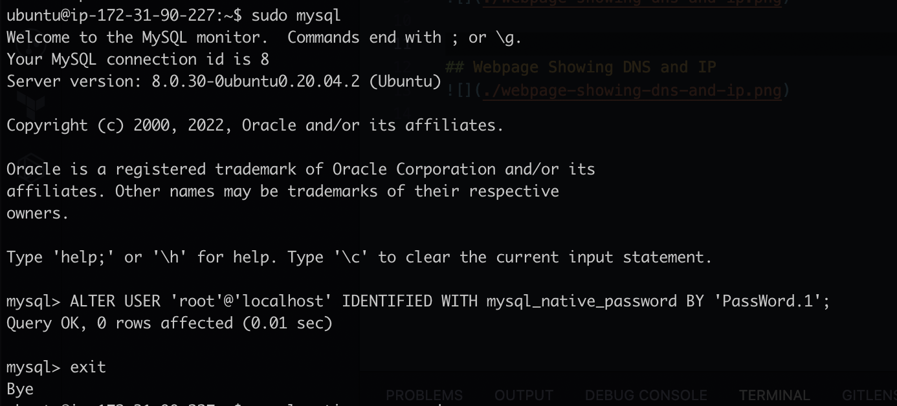

# Project 1 - LAMP Stack Implementation

Find below images showing results of execution of LAMP Stack installation steps

## Instance on AWS

## Webpage Showing DNS and IP

## Mysql Installation and Successful Login

## Vim editor showing VirtualHost Config Modification

## Webpage showing .php file

