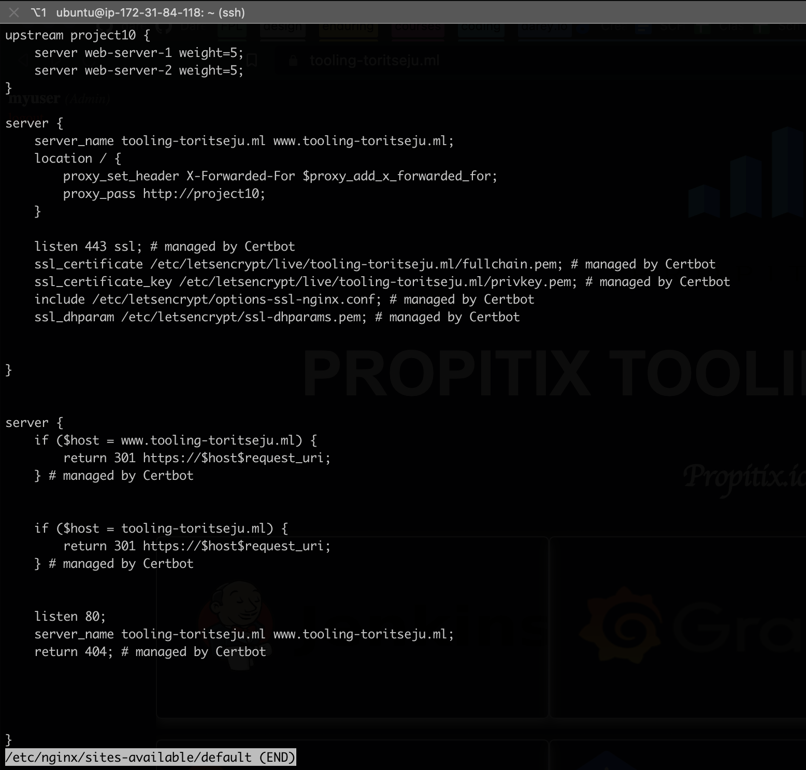
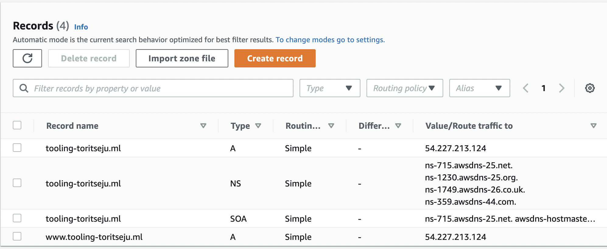
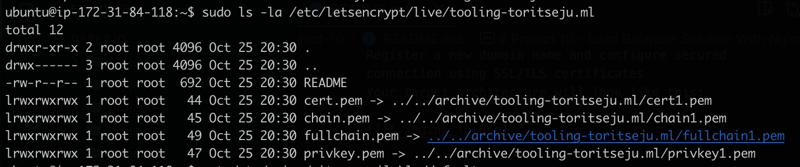
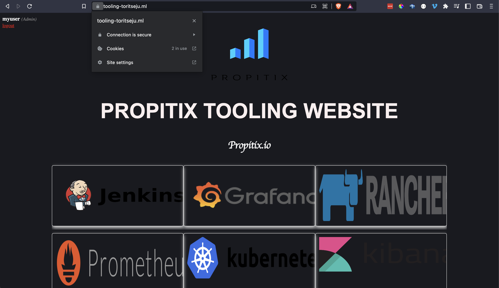

# Project 10 - Load Balancer Solution With Nginx and SSL/TLS

Task
This project consists of two parts:

Configure Nginx as a Load Balancer
Register a new domain name and configure secured connection using SSL/TLS certificates
Your target architecture will look like this:  

### Configure Nginx as a Load Balancer

Installed and configured nginx on previous LB server after uninstalling apache2.  

### Setup Domain name and DNS records

### Install Certbot and configure secure connection using ssl/tls certificates

### Https Connection via browser

Connect to Nginx Load Balancer via https using domain name  

