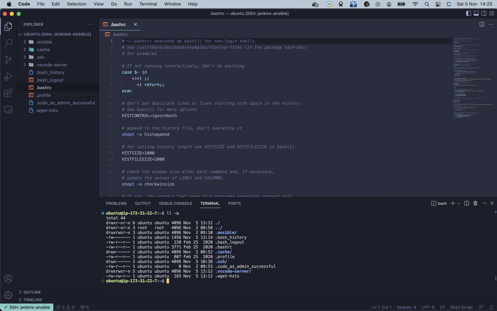

# Project 11 - Ansible Configuration Management: Automate Project 7 - 10

## Task
- Install and configure Ansible client to act as a Jump Server/Bastion Host
- Create a simple Ansible playbook to automate servers configuration

## Repo
Find repository [here](https://github.com/toritsejuFO/ansible-config-mgt)


### Instances on AWS
Create **Jenkins-Ansible** EC2 instance and other required instances to carry ansible configuration test  


### Install Ansible on Jenkins-Ansbible Server
```bash
sudo apt update

sudo apt install ansible
```  


### Setup Ansible Inventory and Playbook


### Configure Jenkins and Github Webhook on repository
Configure Jenkins and Github webhook to allow build on merge/push to **main** branch  


### Prepare your development environment using Visual Studio Code
Set up VSCode  to connect remotely to Jenkins-Ansible Server using the extention "Remote Development" from Microsoft  




### Create Playbook

Developed playbook to install wireshark software on the Redhat Servers (Web Server 1 and 2, and DB Server) and the Ubuntu Server (LB Server).  

See playbook file [here](https://github.com/toritsejuFO/ansible-config-mgt/blob/main/playbooks/common.yml) on the repo.

On push to the repo, jenkins server stores artificacts in `/var/lib/jenkins/jobs/ansible/builds/<build_number>/archive/` directory on the Jenkins-Ansible server.


### Run ansible test

To tun the ansible test, we go into the directory where Jenkins stored the artifact of the lastest build, and run the ansible-playbook command  

```bash
cd /var/lib/jenkins/jobs/ansible-config-mgt/builds/20/archive

ansible-playbook -i inventory/dev.yml playbooks/common.yml
```

Below we see the ansible tasks run successful on the target hosts  


Below we see after logging into one of the target servers, that wireshark is successfully installed.  


### Desired ansible architecture achieved


