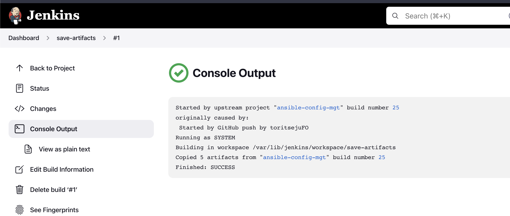
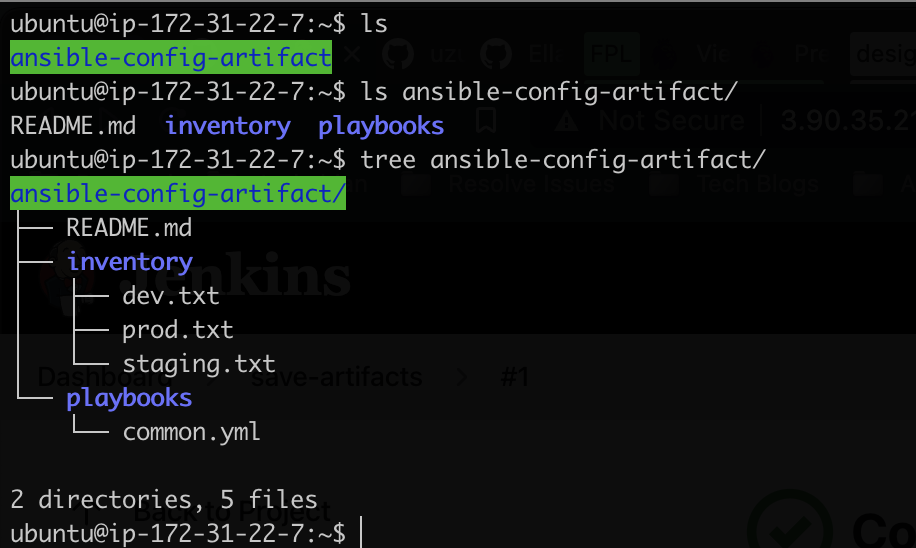
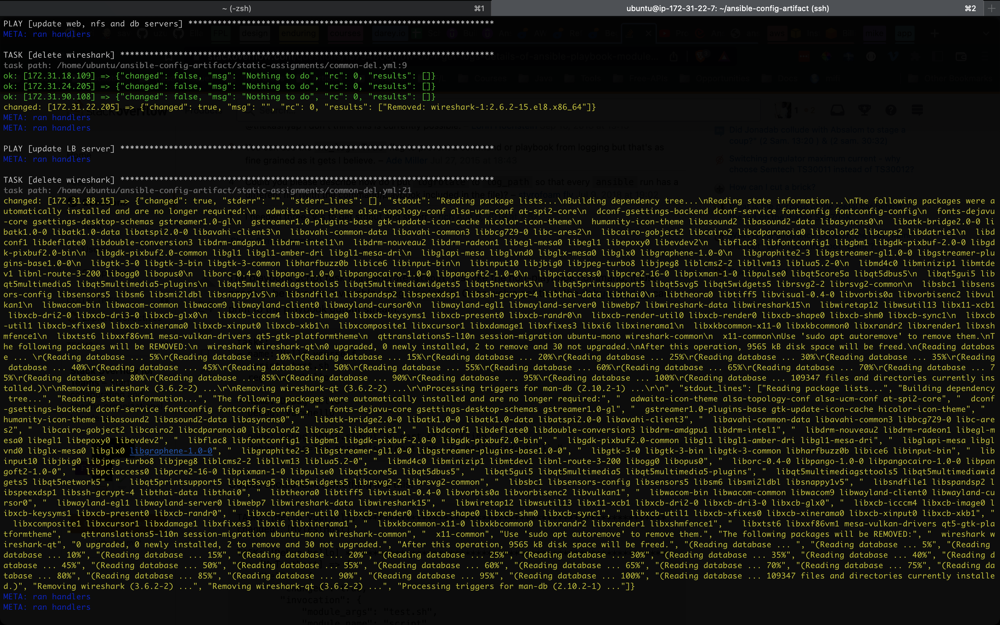
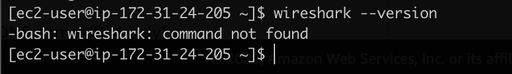
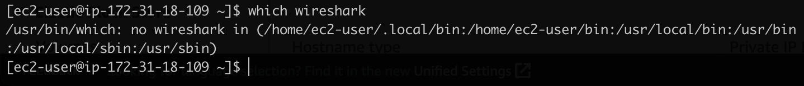
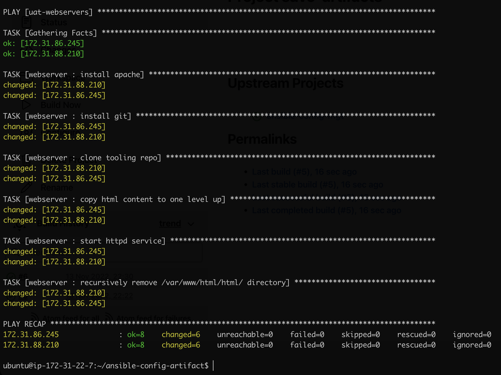

# Project 12 - Ansible Refactoring and Static Assignments (Imports and Roles)

## Task

The goal of the project is to improve the work done in project 11 through refactoring to become more efficient with ansible configuration.

### Step 1 - Jenkins Job Enhancement

- Created directory to store latest successful build from **ansible-config-mgt** job `sudo mkdir /home/ubuntu/ansible-config-artifact`
- Changed permissions on directory `chmod -R 0777 /home/ubuntu/ansible-config-artifact`
- Installed **Copy Artifacts** plugin on jenkins
- Created a new project **save-artifacts** on jenkins
- Made a change on **ansible-config-mgt** repo to trigger job, and afterwards trigger **save-artifacts** job


Below is the output of a build on the **save-artifacts** project on jenkins, triggered automatically after a successful build of the **ansible-config-mgt** project  



Below is the directory showing the copied artifacts generated from the latest build of the **ansible-config-mgt** job  




### Step 2 - Refactor Ansible code by importing other playbooks into site.yml

- Created [site.yml](https://github.com/toritsejuFO/ansible-config-mgt/blob/main/playbooks/site.yml)
- Created [common-del.yml](https://github.com/toritsejuFO/ansible-config-mgt/blob/main/static-assignments/common-del.yml)
- Pushed changes to trigger build on jenkins server
- Ran ansible command to undo [common.yml](https://github.com/toritsejuFO/ansible-config-mgt/blob/main/static-assignments/common.yml) delete wireshark

```bash
cd /home/ubuntu/ansible-config-mgt/

ansible-playbook -i inventory/dev.yml playbooks/site.yaml
```

Below shows successful ansible playbook uninstalling wireshark  



Below shows that wireshark is uninstalled from a couple of samples of our target servers  





### Step 3 - Configure UAT Webservers with a role ‘Webserver’

Created webserver role tasks [here](https://github.com/toritsejuFO/ansible-config-mgt/blob/main/roles/tasks/main.yml), which performs the below instructions when run

- Install and configure Apache (httpd service)
- Clone Tooling website from [GitHub repo](https://github.com/toritsejuFO/tooling.git)
- Ensure the tooling website code is deployed to /var/www/html on each of 2 UAT Web servers.
- Copy html files over to root server directory 
- Make sure httpd service is started
- Cleanup unused html folder

Configuration of UAT server private IPs in ansible inventory [uat configuration file](https://github.com/toritsejuFO/ansible-config-mgt/blob/main/inventory/uat.txt)


Below is an image of the successful ansible playbook task ran on uat servers  



Below is a sample of one of the uat servers displaying running tooling website  


