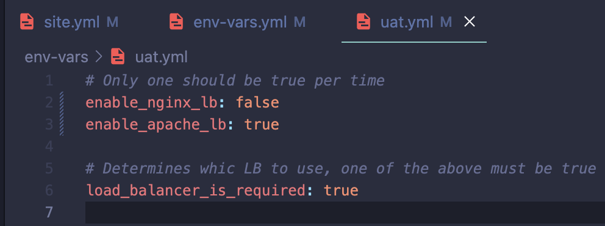

# Project 13 - Ansible Dynamic Assignments (Include) and Community Roles

## Synopsis
This builds on [project 11](https://github.com/toritsejuFO/darey.io-projects/tree/main/project-11) and [project 12](https://github.com/toritsejuFO/darey.io-projects/tree/main/project-12) to continue learning about ansible dynamic assignments using includes.

To setup Load Balancing for the UAT webservers using community/custom roles.

### Setup Load Balancer Roles

##### 1. NGINX
Enabled nginx LB in dynamic configuration  

Executed playbook show nginx being configured on LB server and apache being skipped  

##### 2. APACHE
Enabled nginx LB in dynamic configuration  

Executed playbook show apache being configured on LB server and nginx being skipped  

##### Tooling website viewed via LB

