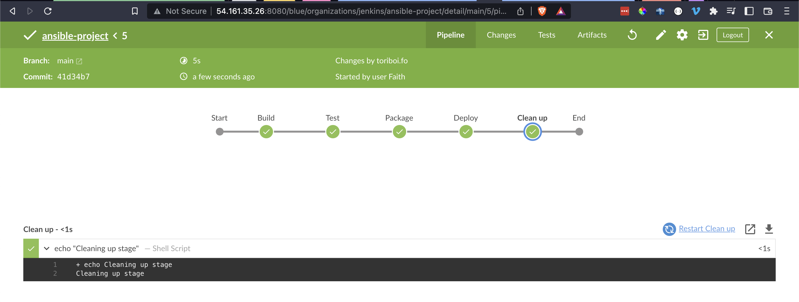
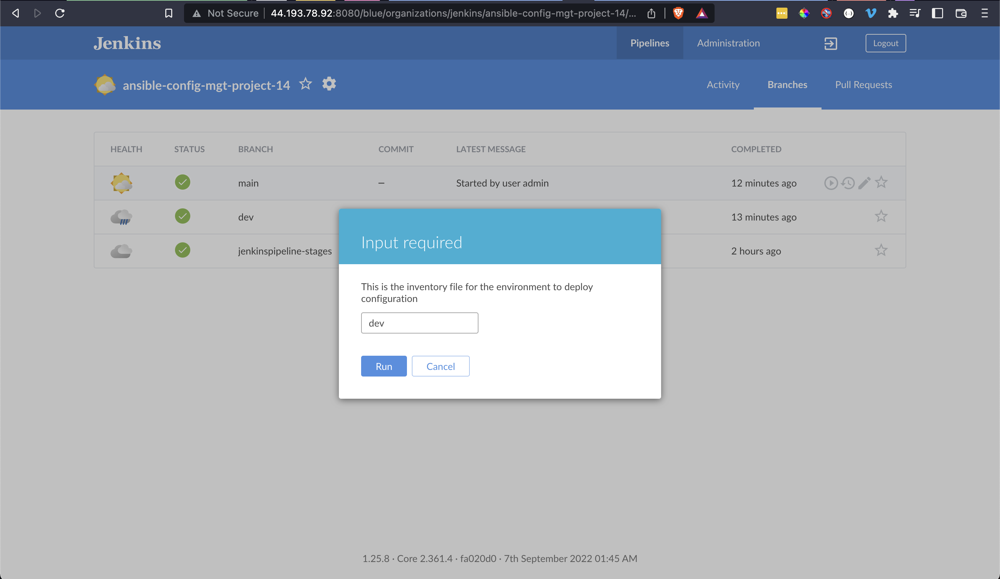
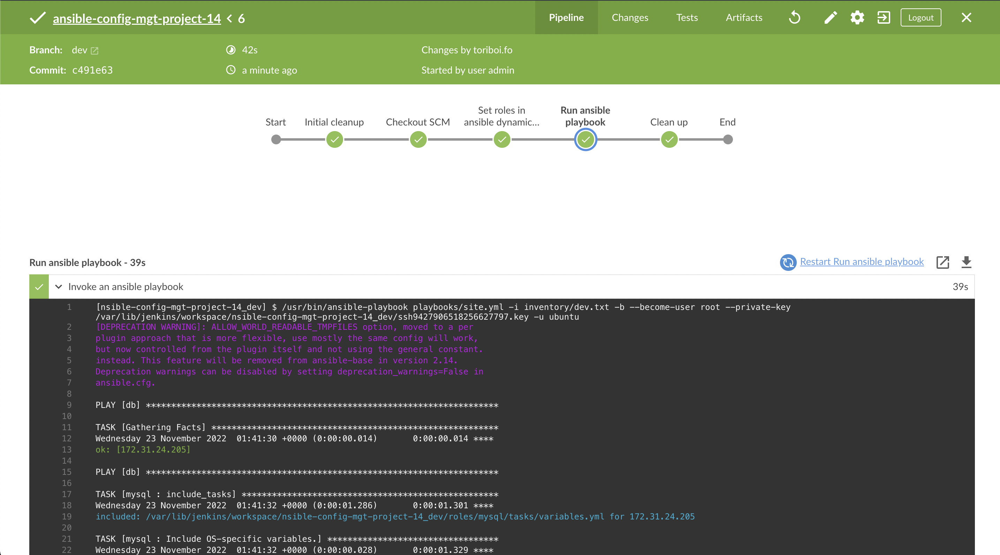
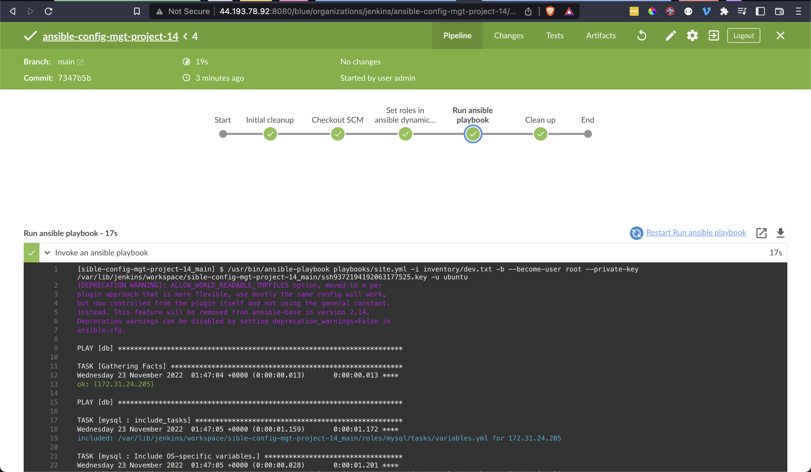
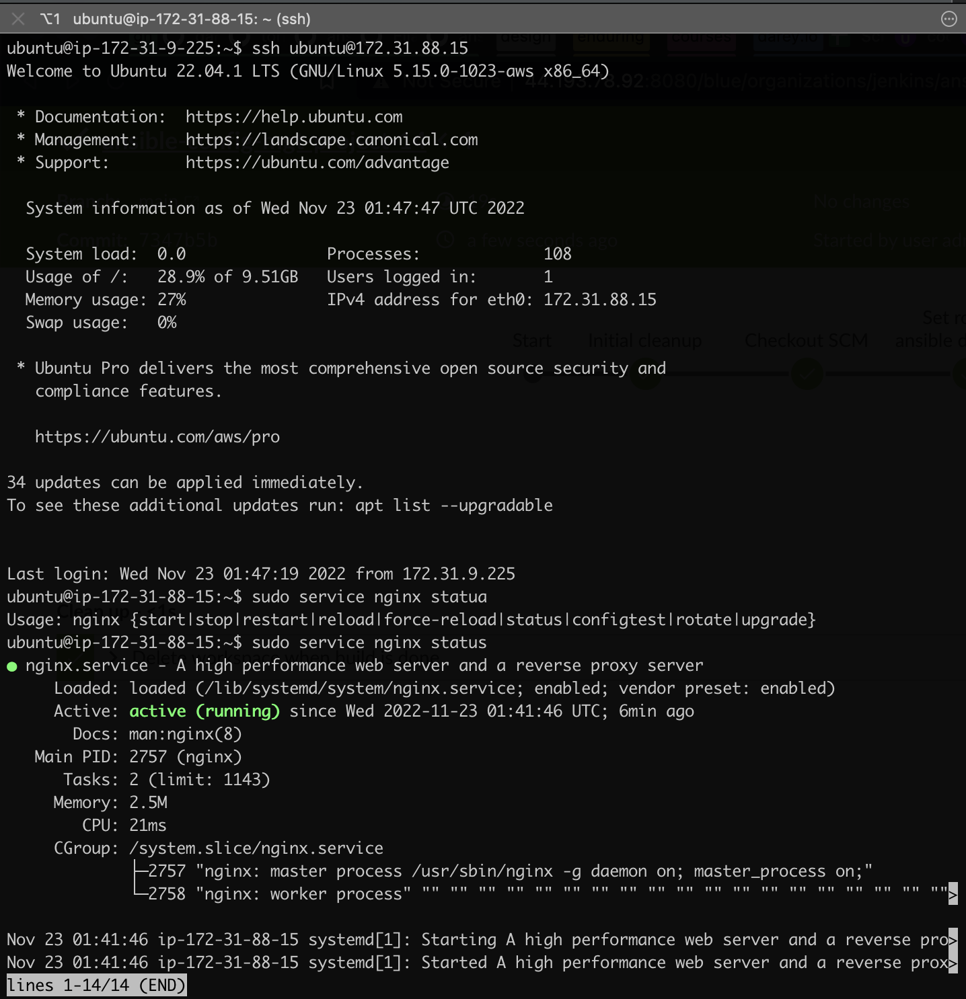
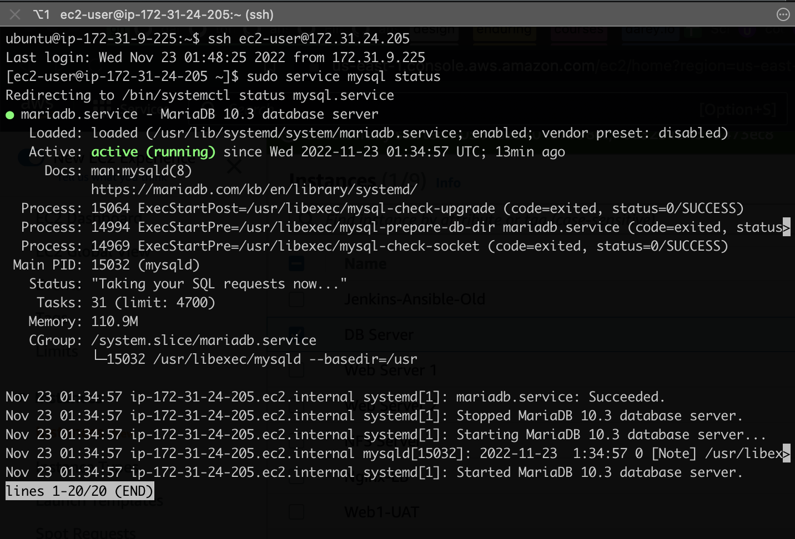

# Project 14 - Experience Continuous Integration With Jenkins | Ansible | Artifactory | Sonarqube | PHP

## Synopsis
Simulating a typical CI/CD pipeline for a PHP based application

As part of the ongoing infrastructure development with Ansible started from [project 11](https://github.com/toritsejuFO/darey.io-projects/tree/main/project-11), you will be tasked to create a pipeline that simulates continuous integration and delivery. Target end to end CI/CD pipeline is represented by the diagram below. It is important to know that both Tooling and TODO Web Applications are based on an interpreted (scripting) language (PHP). It means, it can be deployed directly onto a server and will work without compiling the code to a machine language.

The problem with that approach is, it would be difficult to package and version the software for different releases. And so, in this project, we will be using a different approach for releases, rather than downloading directly from git, we will be using Ansible uri module.  

#### Setup
The final setup to be simulated.  

#### 1. Configuring Ansible For Jenkins Deployment
Reconfigured existing Jenkins server from [project 13](https://github.com/toritsejuFO/darey.io-projects/tree/main/project-11)
- Installed "Blue Ocean" plugin
- Connected Jenkins to github using generated access token
- Created new pipeline to work existing repository
- Added and updated `Jenkinsfile` to contain simple stages
- Committed and pushed
- Triggered build on Jenkins  

#### 2. Run Ansible Playbook from jenkins
* Installed the ansible plugin on jenkins
* Added private ssh key to global credentials on jenkins
* Configured jenkins to run ansible playbook through implementation of stages/steps in `Jenkinsfile`
  - Used the jenkins default `BRANCH_NAME` environment variable in the `checkout SCM` stage to ensure true and dynamic multibranch build based on push. 
  - Ensured deploy environment inventory file was parametarized for ansible
* ssh-ed into nginx and mysql servers to confirm successful installation

See images below:

**2a. Parameterized build**  

**2b. Dynamic Multibranch build for `dev` and `main` without modifying Jenkinsfile**  

  

**2c. Successful Installations for `nginx` and `mysql` servers**  

  

