# Project 15 - AWS Cloud Solution For 2 Company Websites Using A Reverse Proxy Technology

## Task
-------

You will build a secure infrastructure inside AWS VPC (Virtual Private Cloud) network for a fictitious company (Choose an interesting name for it) that uses WordPress CMS for its main business website, and a Tooling Website (https://github.com/toritsejufo/tooling) for their DevOps team. As part of the company’s desire for improved security and performance, a decision has been made to use a reverse proxy technology from NGINX to achieve this.

Cost, Security, and Scalability are the major requirements for this project. Hence, implementing the architecture designed below, ensure that infrastructure for both websites, WordPress and Tooling, is resilient to Web Server’s failures, can accomodate to increased traffic and, at the same time, has reasonable cost.

### A. Set Up a Virtual Private Network (VPC)
---------------------------------------------

1. Created a VPC

2. Created subnets as shown in the architecture

3. Created a route table and associate it with public subnets
4. Create a route table and associate it with private subnets

5. Created an Internet Gateway

6. Edited a route in public route table, and associated it with the Internet Gateway. (This is what allows a public subnet to be accisble from the Internet)

7. Created 3 Elastic IPs

8. Created a Nat Gateway and assign one of the Elastic IPs (*The other 2 will be used by Bastion hosts)

9. Created a Security Group for:
    - **Nginx Servers**: Access to Nginx should only be allowed from a Application Load balancer (ALB). At this point, we have not created a load balancer, therefore we will update the rules later. For now, just create it and put some dummy records as a place holder.
    - **Bastion Servers**: Access to the Bastion servers should be allowed only from workstations that need to SSH into the bastion servers. Hence, you can use your workstation public IP address. To get this information, simply go to your terminal and type curl www.canhazip.com
    - **Application Load Balancer**: ALB will be available from the Internet
    - **Webservers**: Access to Webservers should only be allowed from the Nginx servers. Since we do not have the servers created yet, just put some dummy records as a place holder, we will update it later.
    - **Data Layer**: Access to the Data layer, which is comprised of Amazon Relational Database Service (RDS) and Amazon Elastic File System (EFS) must be carefully desinged – only webservers should be able to connect to RDS, while Nginx and Webservers will have access to EFS Mountpoint.

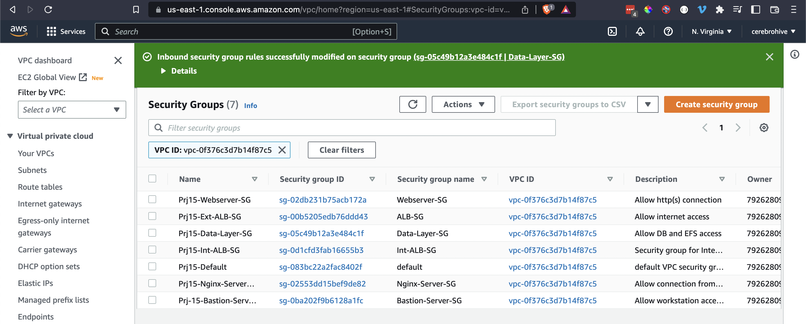

### B. Setup EFS

In this project, we will utulize EFS service and mount filesystems on both Nginx and Webservers to store data.

1. Created an EFS filesystem
2. Created an EFS mount target per AZ in the VPC, associate it with both subnets dedicated for data layer
3. Associated the Security groups created earlier for data layer.
4. Created an EFS access point

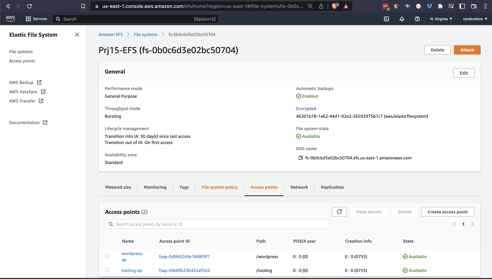

### C. Setup RDS

Pre-requisite: Created a KMS key from Key Management Service (KMS) to be used to encrypt the database instance.

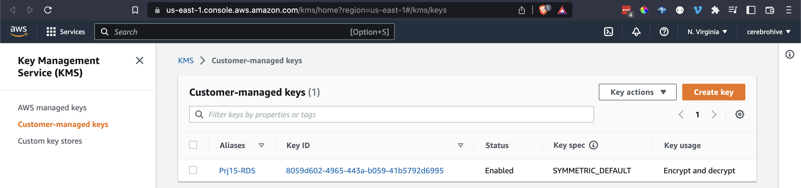

1. Created a subnet group and add 2 private subnets (data Layer)
2. Created an RDS Instance for mysql 8.*.* in the Free tier which allows KMS encryption as of today
3. Configured other settings accordingly

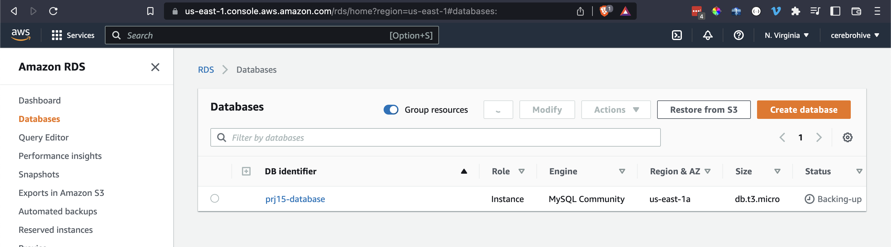

### D. Set Up Compute Resources for Nginx, Bastion Host and Webserver

- EC2 Instances (AMI from EC2)
- Launch Templates
- Target Groups
- Autoscaling Groups
- TLS Certificates
- Application Load Balancers (ALB)

Created instances in publis subnet, and made the necessary software installations on them.

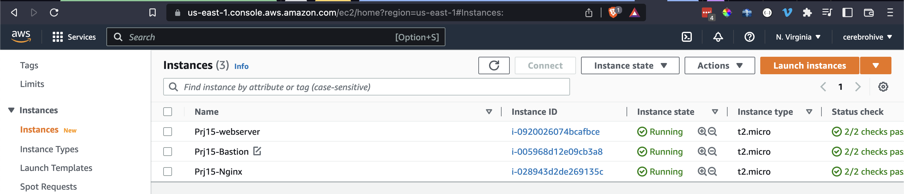

Created AMI from each of the EC2 instances

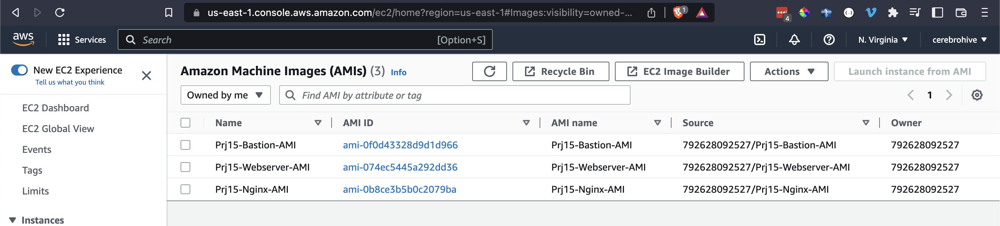

Created Configured Target Groups

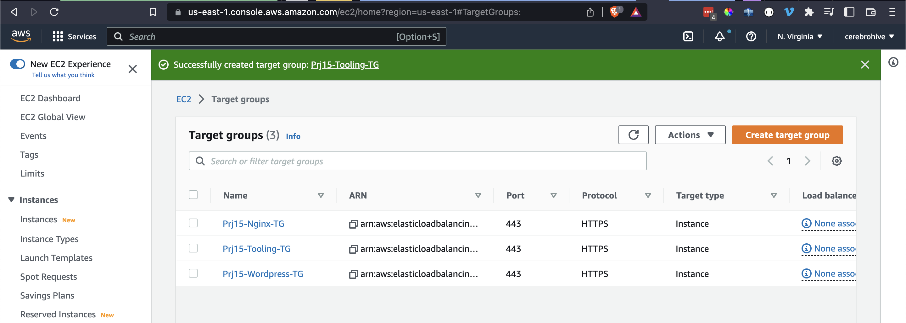

Created External (Internet facing) and Internal Application Load Balancer towards

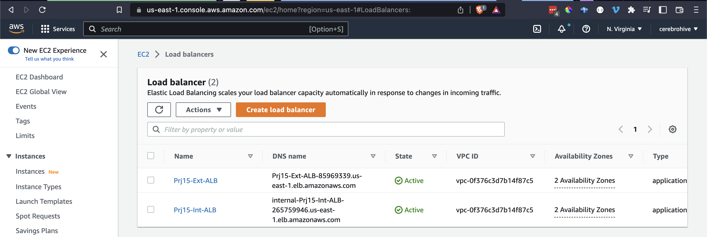

Created Launch templates for Nginx, Webservers and Bastion host

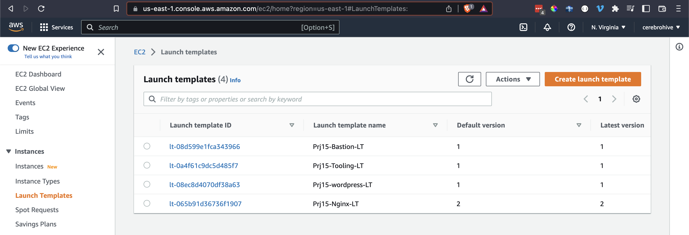

Created and Autosacling Groups for Nginx, Webservers and Bastion host

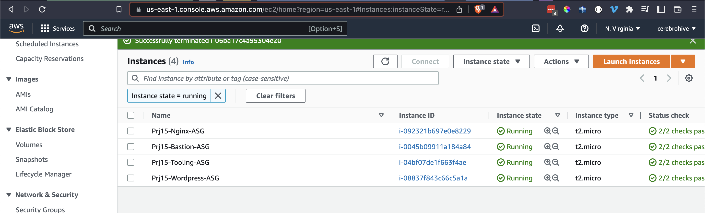

Route53 setup to External Load Balancer

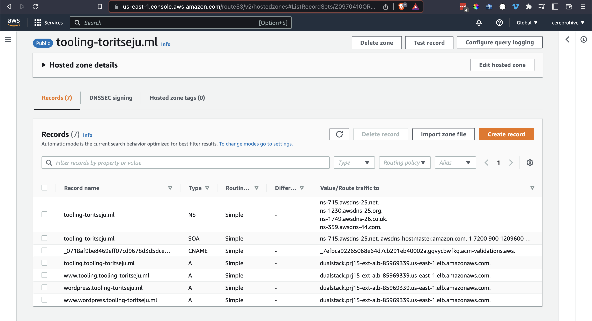

### E. Tooling and Wordpress website

Secured (https) access to the tooling and wordpress site via External Load balancer using our route53 domain-DNS setup

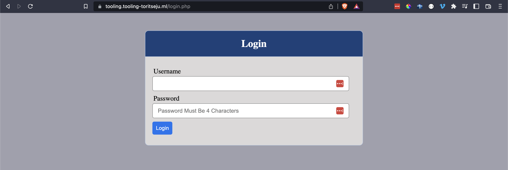

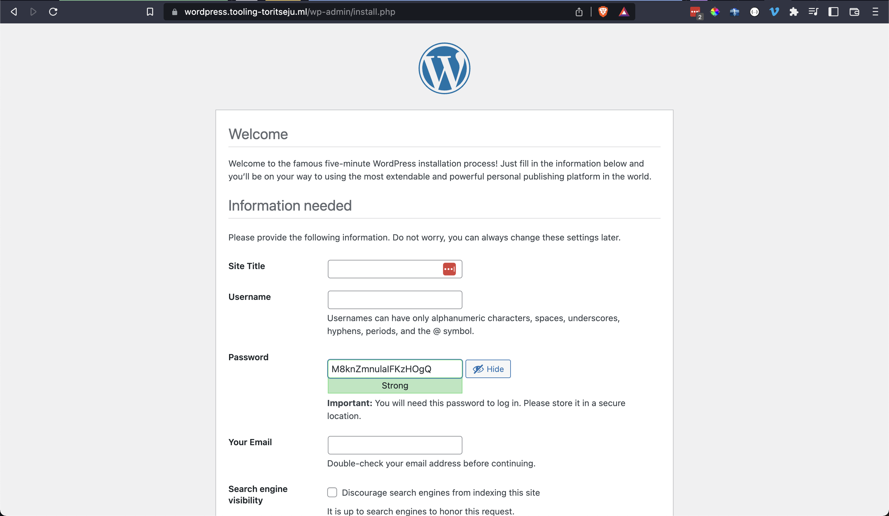
