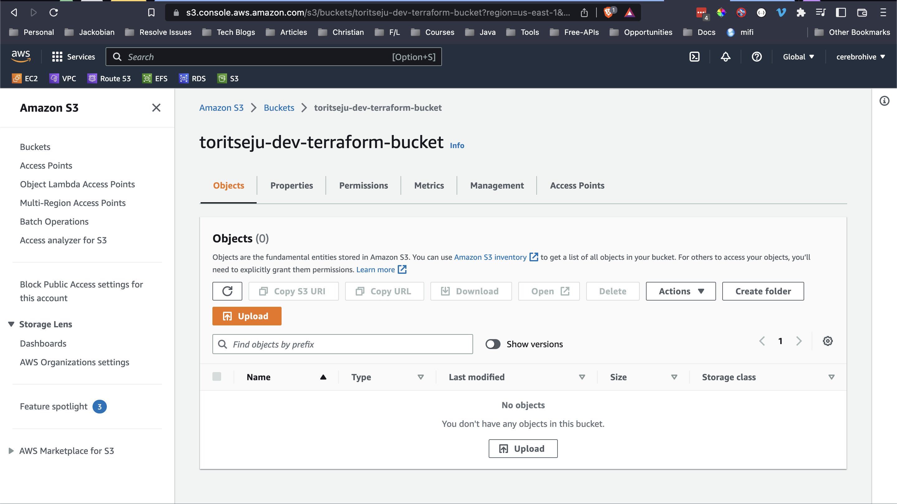
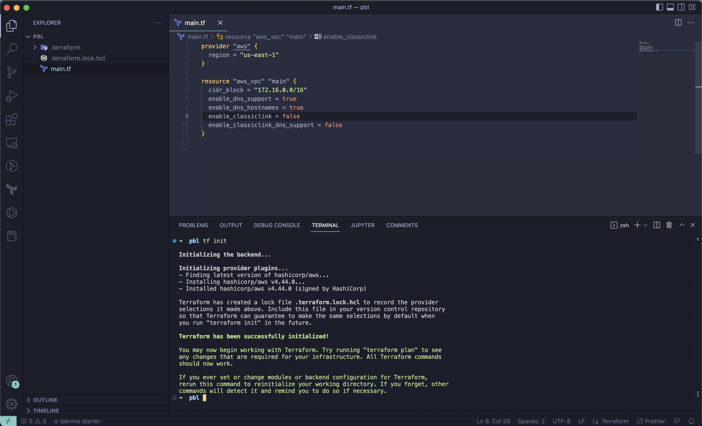
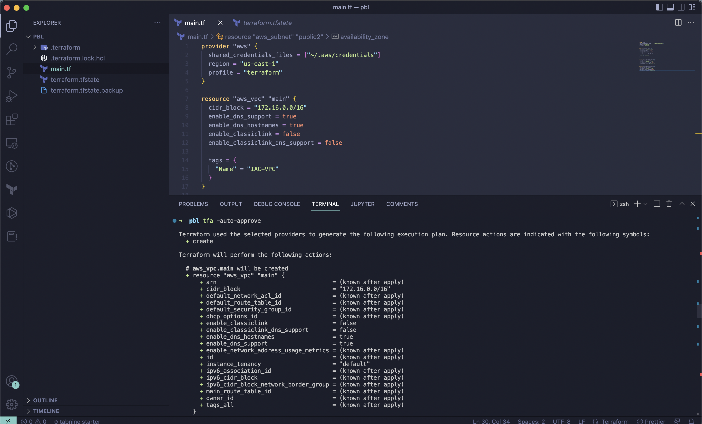
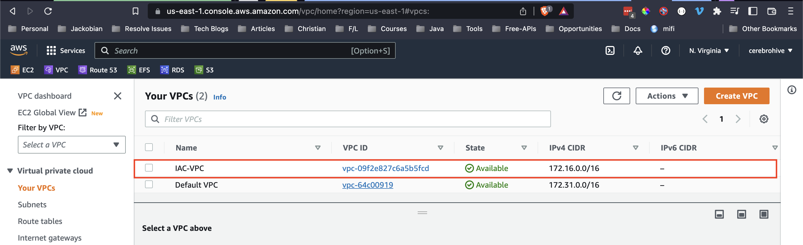
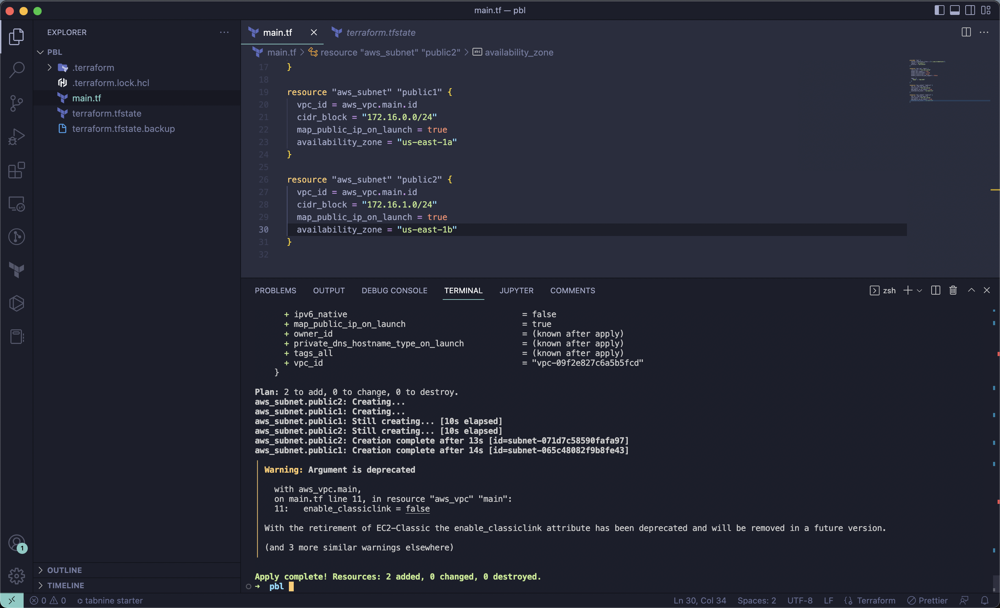
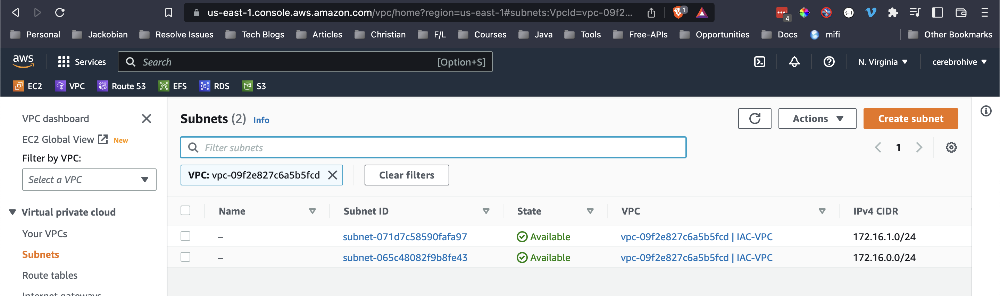
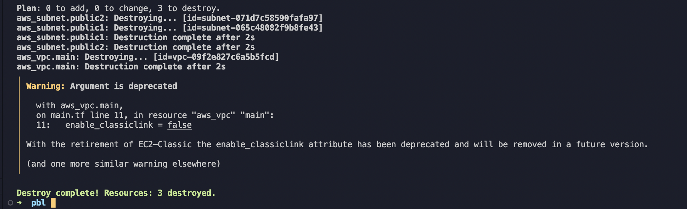
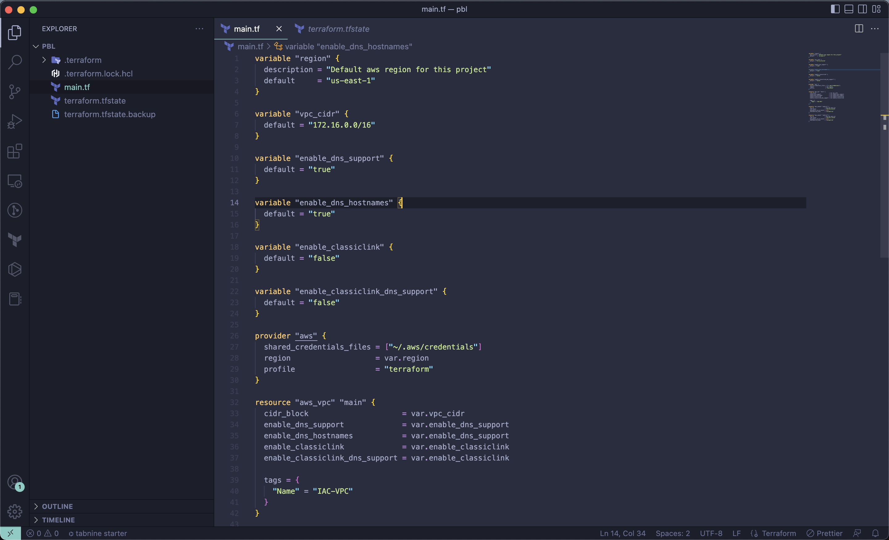
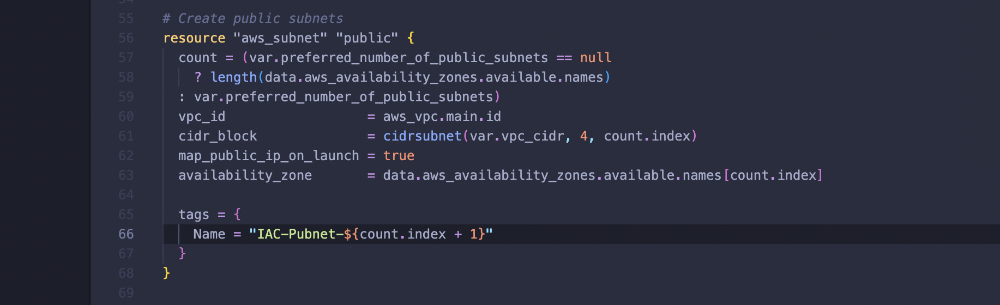
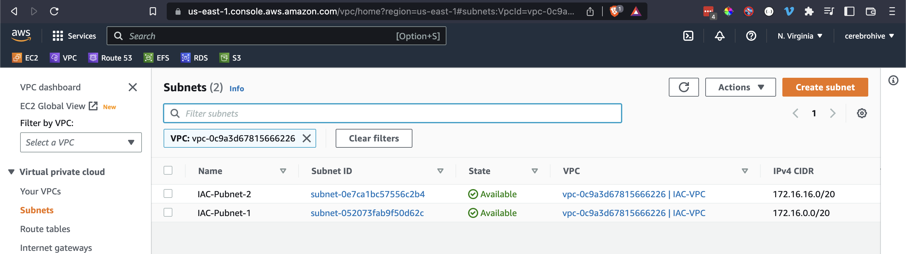

# Project 16 - Automate Infrastructure With IAC using Terraform Part 1

## Task
-------
After you have built AWS infrastructure for 2 websites manually in [project 15](https://github.com/toritsejuFO/darey.io-projects/tree/main/project-15), it is time to automate the process using Terraform.

Let us start building the same set up with the power of Infrastructure as Code (IaC)

### Prerequisites before you begin writing Terraform code

Created an S3 bucket to store Terraform state file which wil be used in project 17

### 1. VPC | Subnets | Security Groups

Ran `terraform init` to install terraform provider

#### 1.1. Provider and VPC resource section

Ran `terraform plan` to view what terraform will create and `terraform apply` to create VPC on aws

**Note**:
I used the `shared_credentials_files` key under the aws provider block to target my credentials file and the particular *profile* I want to use when running terraform against aws.

#### 1.2. Subnets resource section

According to our architectural design, we require 6 subnets:

- 2 public
- 2 private for webservers
- 2 private for data layer

Below I created the first 2 public subnets.

#### Observations:
**Hard coded values**: Remember our best practice hint from the beginning? Both the availability_zone and cidr_block arguments are hard coded. We should always endeavour to make our work dynamic.

**Multiple Resource Blocks**: Notice that we have declared multiple resource blocks for each subnet in the code. This is bad coding practice. We need to create a single resource block that can dynamically create resources without specifying multiple blocks. Imagine if we wanted to create 10 subnets, our code would look very clumsy. So, we need to optimize this by introducing a count argument.

#### Destroy Infracstruture to Allow for Refactoring

Ran `terraform destroy` to delete the vpc and public subnets previously created in order to address the observations mentioned above

### 2. Fixing The Problems By Code Refactoring

Fixing Hard Coded Values: introduced variables, and remove hard coding.

Fixing multiple resource blocks: introduced some interesting concepts e.g Loops & Data sources

Ran `terraform apply` after refactoring, added tags to each subnet

### 3. Introducing variables.tf & terraform.tfvars

Instead of havng a long list of variables in main.tf file, we can actually make our code a lot more readable and better structured by moving out some parts of the configuration content to other files.

* We will put all variable declarations in a separate file
* And provide non default values to each of them

1. Created a new file and name it variables.tf
2. Copied all the variable declarations into the new file.
3. Created another file, name it terraform.tfvars
4. Set values for each of the variables.

# Codes
Code can be found in the [pbl-terraform tag:project16](https://github.com/toritsejuFO/pbl-terraform/tree/project16) folder.
