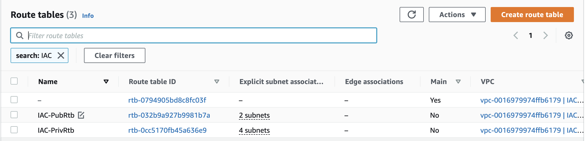

# Project 17 - Automate Infrastructure With IAC using Terraform Part 2

## Tasks
--------
Continue Infrastructure Automation with Terraform. Based on the knowledge from the previous project we will keep on creating AWS resources!

### Terraform plan and apply

Running `terraform apply -auto-approve` to create all resources. I ran this command at different times as I executed the project, but also destroyed along the way when taking breaks to avoid accruing cost, so at the end of it all, I ran it to create all the resources

Running `terraform destroy -auto-approve` to delete all resources

*The next sections show the successful creations of resources on AWS after a successful run of the `terraform apply -auto-approve` command*

### 1. Networking

Created 4 private subnets. Continued with the principles around refactoring learnt from the last project, such as;
* Used `length` function to function to determine count value
* Used `cidrsubnet` function to dynamically get subnet cidr block ips
* Kept variables and resources in separate files for better code structure and readability
* Tagged resources properly. Also used string formatting for dynamically generating tag names

#### 1.1 Create private subnets

Public and private subnets shown on AWS  

#### 1.2 Create Internet Gateway

Internet gateway shown on AWS  

#### 1.3 Create NAT Gateway and Elastic IP

NAT Gateway and EIP shown on AWS
  

#### 1.4 Create Routes Table, its Association, and Routes

Route table shown on AWS  

### 2. Security Groups, 

#### 2.1 Create Security Groups for all resources

Security groups shown on AWS

### 3. ACM Certificate, ALB, and Target Group, SNS

#### 3.1 Create Certificate and Perform DNS Validation automatically

Certificate issued after dns validation

#### 3.2 Create ALB

External and Internal ALB created on AWS

#### 3.3 Create Target Groups

Target groups created on AWS

#### 3.4 Create SNS topics for Autoscaling Group

SNS topic created for Autoscaling group and notifications setup

### 4. AWS Identity and Access Management

We now move on to creating Compute and Access Control configuration automation using Terraform!

#### 4.1 Create IaM and Roles

EC2 instance role created on AWS

EC2 instance policy attached to EC2 instance role created on AWS

### 5. Autoscaling Group

#### 5.1 Create Autoscaling Group

Autoscaling groups shown on AWS

EC2 Instances launched by autoscaling group

### 6. EFS and RDS

#### 6.1 Create EFS

Created EFS and mountpoints

#### 6.2 Create EFS

RDS instances created on AWS

# Codes
Code can be found in the [pbl-terraform tag:project17](https://github.com/toritsejuFO/pbl-terraform/tree/project17) repo.
