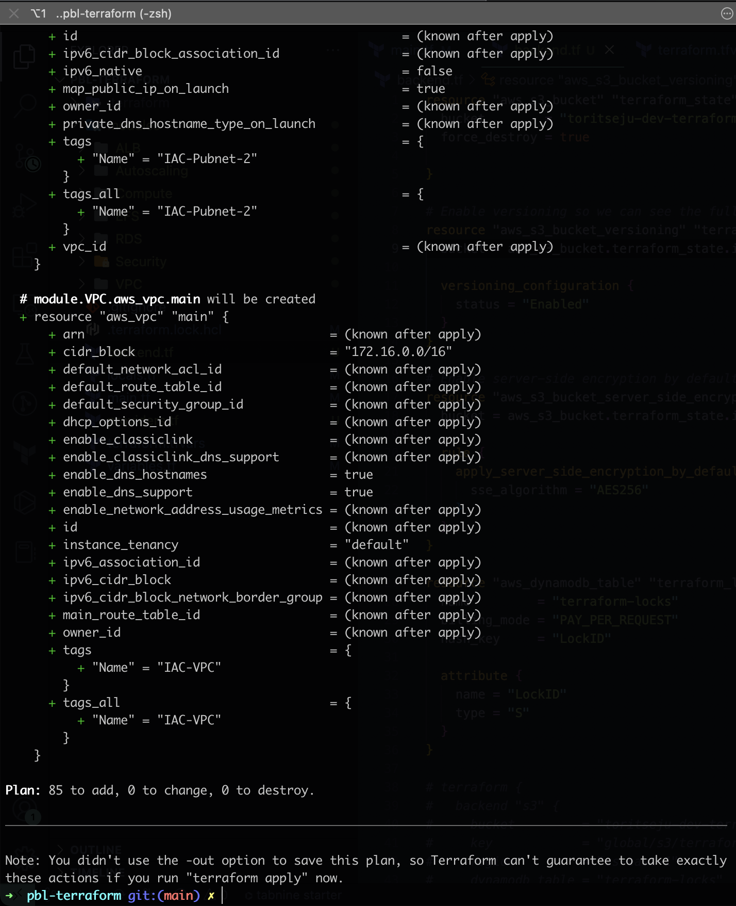

# Project 18 - Automate Infrastructure With IAC using Terraform Part 3

## Tasks
--------
Continue Infrastructure Automation with Terraform. In this project, we'll be introducing remote state, modules and other terraform mechanisms to improve upon what we did in project 17.

### 1. Configure Remote State using AWS S3

Here is our plan to Re-initialize Terraform to use S3 backend:

* Add **S3** and **DynamoDB** resource blocks before deleting the local state file
* Update terraform block to introduce backend and locking
* Re-initialize terraform
* Delete the local tfstate file and check the one in S3 bucket
* Add `outputs`
* Run `terraform apply`

**S3 State**

**Dynamodb**

### 2. Refactoring using Modules

Module breakdown
- modules
  - ALB: For Apllication Load balancer and similar resources
  - EFS: For Elastic file system resources
  - RDS: For Databases resources
  - Autoscaling: For Autosacling and launch template resources
  - compute: For EC2 and rlated resources
  - VPC: For VPC and netowrking resources such as subnets, roles, e.t.c.
  - security: for creating security group resources

#### Running `Terraform plan`

#### Running `Terraform plan` after configuring state backend to use s3

# Codes
Code can be found in the [pbl-terraform tag:project18](https://github.com/toritsejuFO/pbl-terraform/tree/project18) repo.
