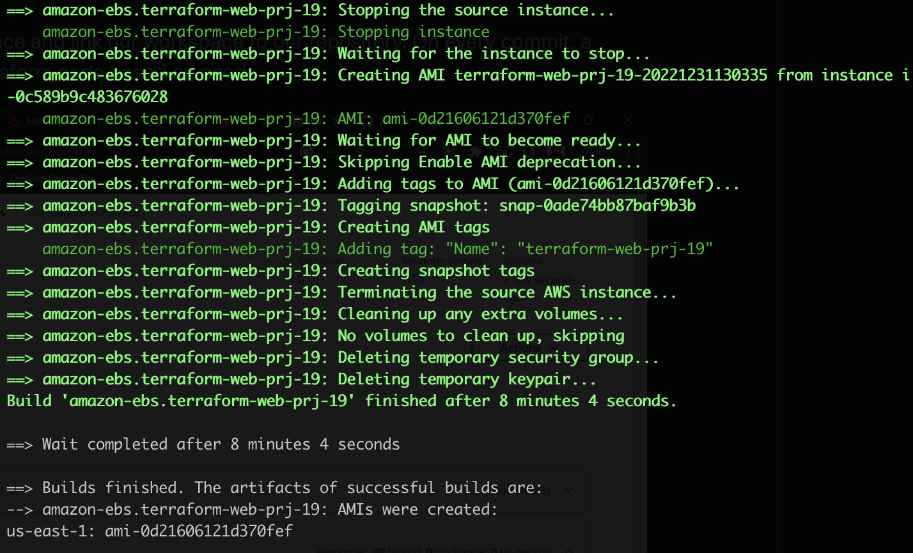
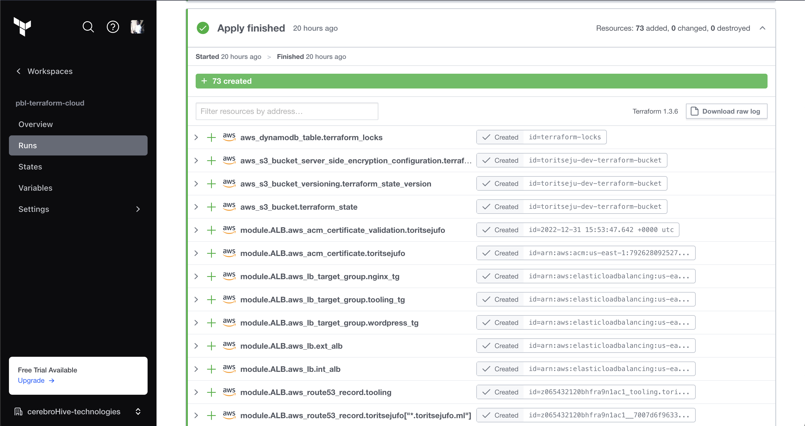
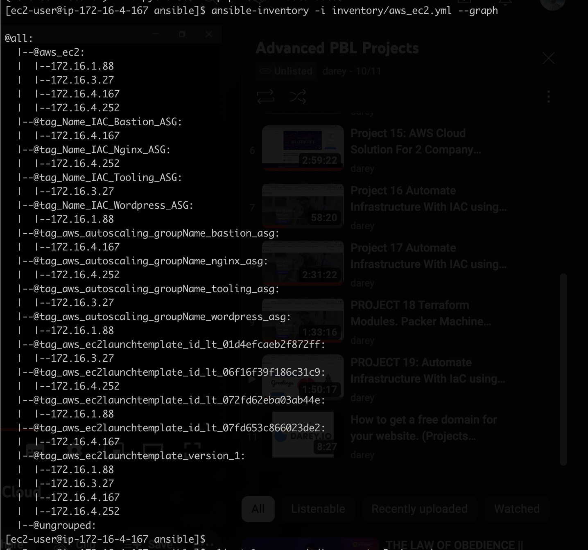
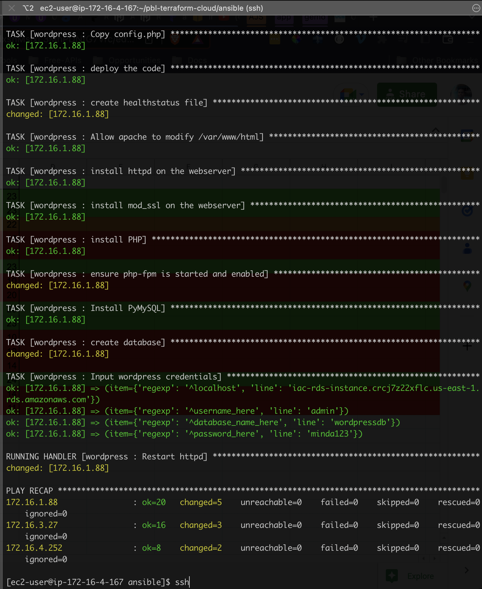
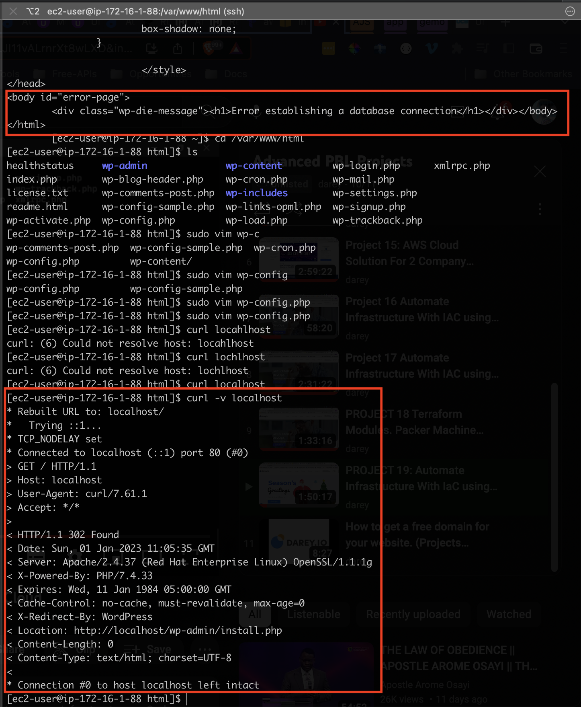
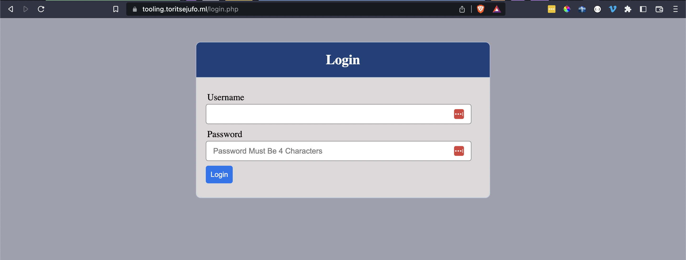
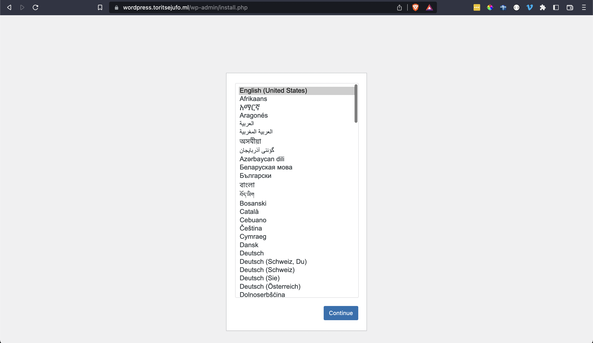

# Project 19 - Automate Infrastructure With IAC using Terraform Part 4 - Terrafrom Cloud

## Synopsis
-------
In this project, we move what we've done so far locally using terraform to terraform cloud. This is the last part of the IAC project using terraform, which started from [project 16](https://github.com/toritsejuFO/pbl-terraform/tree/project16).

[Terraform Cloud](https://www.terraform.io/cloud) is a managed service that provides you with Terraform CLI to provision infrastructure, either on demand or in response to various events.

By virtue of the degree of changes required, we discontinued with the former [repo](https://github.com/toritsejuFO/pbl-terraform) where we have implemented projects 16, 17 and 18. See [Code](#code) section below to link to repository for this project.

### Steps

* Setup Packer sub directory to help us generate our AMIs on AWS
* Setup Ansible sub directory to handle configuration of the infrastructure after terraform deployment
* Updated terraform modules at different stages till final deployment is complete
* Ssh-ed into Bastion host to configure and update ansible scripts e.g **RDS endpoints**, **EFS access points**, **DB roles for tooling and wordpress** and more.
* Test that websites work

### Screenshots

Below are some screenshot showcasing project implementation

#### Ran packer to generate AMIs on AWS  

#### Auto run of terraform plan and apply after pushing changes to git

#### Check of dynamic inventory using ansible

#### Successful run of ansible play to configure infrastructure

#### Debug wordpress db connection

#### Tooling website up and running

#### Wordpress website up and running

# Code
Code can be found in the [pbl-terraform-cloud](https://github.com/toritsejuFO/pbl-terraform-cloud) repo.
