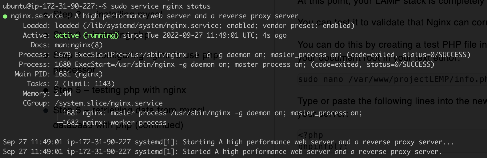

# Project 1 - LEMP Stack Implementation

Find below images showing results of execution of LEMP Stack installation steps

## Instance on AWS

## Webpage Showing DNS and IP

## Mysql Installation and Successful Login

## Nano editor showing Nginx config

## Status of Nginx server running

## Webpage showing php file

## Example DB Setup

## Webpage Showing Todolist

### Note for Review
_I used the same ec2 instance for the LAMP stack setup to setup LEMP stack. I only stopped it, hence my mysql installation was still intact when I restarted it. Hence avoiding re-installation._
