# Project 20 - Migration to the Сloud with containerization. Part 1 - Docker & Docker Compose

## Synopsis
-----------

Until now, you have been using VMs (AWS EC2) in Amazon Virtual Private Cloud (AWS VPC) to deploy your web solutions, and it works well in many cases. You have learned how easy to spin up and configure a new EC2 manually or with such tools as Terraform and Ansible to automate provisioning and configuration. You have also deployed two different websites on the same VM; this approach is scalable, but to some extent; imagine what if you need to deploy many small applications (it can be web front-end, web-backend, processing jobs, monitoring, logging solutions, etc.) and some of the applications will require various OS and runtimes of different versions and conflicting dependencies – in such case you would need to spin up serves for each group of applications with the exact OS/runtime/dependencies requirements. When it scales out to tens/hundreds and even thousands of applications (e.g., when we talk of microservice architecture), this approach becomes very tedious and challenging to maintain.

In this project, we will learn how to solve this problem and practice the technology that revolutionized application distribution and deployment back in 2013! We are talking of Containers and imply Docker. Even though there are other application containerization technologies, Docker is the standard and the default choice for shipping your app in a container!

### Understanding why we need docker instead of a VM

As you have already learned – unlike a VM, Docker allocated not the whole guest OS for your application, but only isolated minimal part of it – this isolated container has all that your application needs and at the same time is lighter, faster, and can be shipped as a Docker image to multiple physical or virtual environments, as long as this environment can run Docker engine. This approach also solves the environment incompatibility issue. It is a well-known problem when a developer sends his application to you, you try to deploy it, deployment fails, and the developer replies, "- It works on my machine!". With Docker – if the application is shipped as a container, it has its own environment isolated from the rest of the world, and it will always work the same way on any server that has Docker engine.

### 1. Mysql in Container

#### 1.1 Pull MySQL Docker Image from Docker Hub Registry

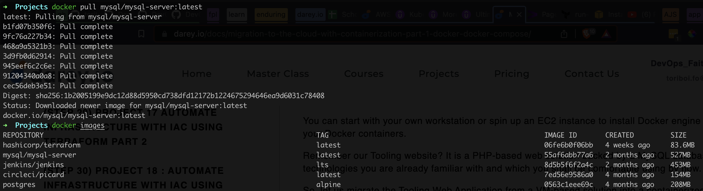

#### 1.2 Deploy the MySQL Container to your Docker Engine

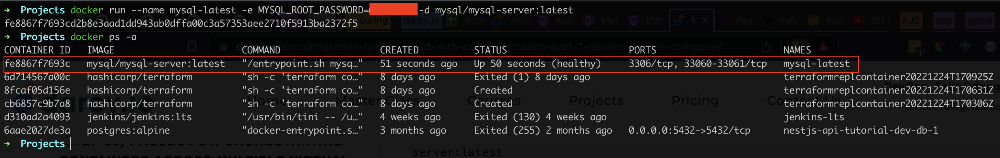

#### 1.3 Connecting to the MySQL Docker Container

##### 1.3.1 Approach 1: Connecting directly to the container running the MySQL server

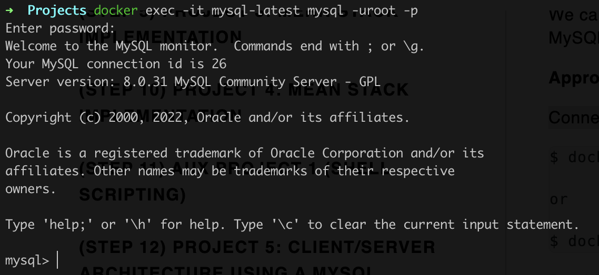

##### 1.3.2 Approach 2: Connecting directly to the container running the MySQL server

Stop and delete Mysql server container  

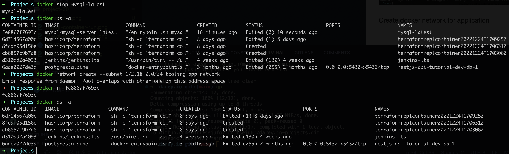

Create docker network for application  

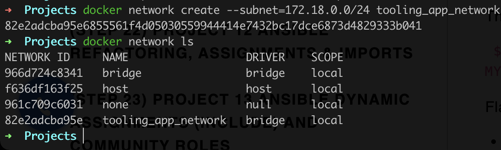

Export Mysql password as shell variable and rerun mysql server connected to network

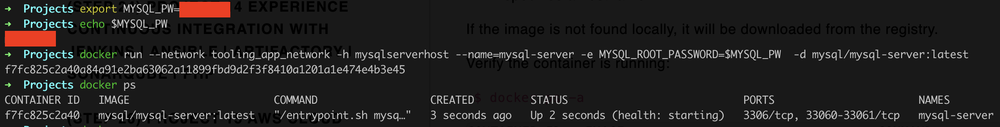

Create sql script to create user

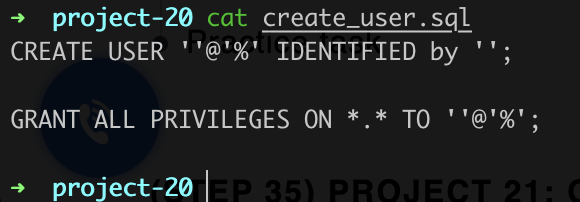

Run script on server and connect from client

### 2. Prepare DB Schema

1. Clone tooling repo
  `$ git clone https://github.com/darey-devops/tooling.git`

2. Export the location of the SQL file
  `$ export tooling_db_schema=/tooling_db_schema.sql`

3. Use the SQL script to create the database and prepare the schema. With the docker exec command, you can execute a command in a running container.
  `$ docker exec -i mysql-server mysql -uroot -p$MYSQL_PW < $tooling_db_schema`

4. Update the .env file with connection details to the database

5. Run the Tooling App

### 3. Containerize Tooling App

1. Inside the tooling dir, build container
  `docker build -t tooling:0.0.1 .`

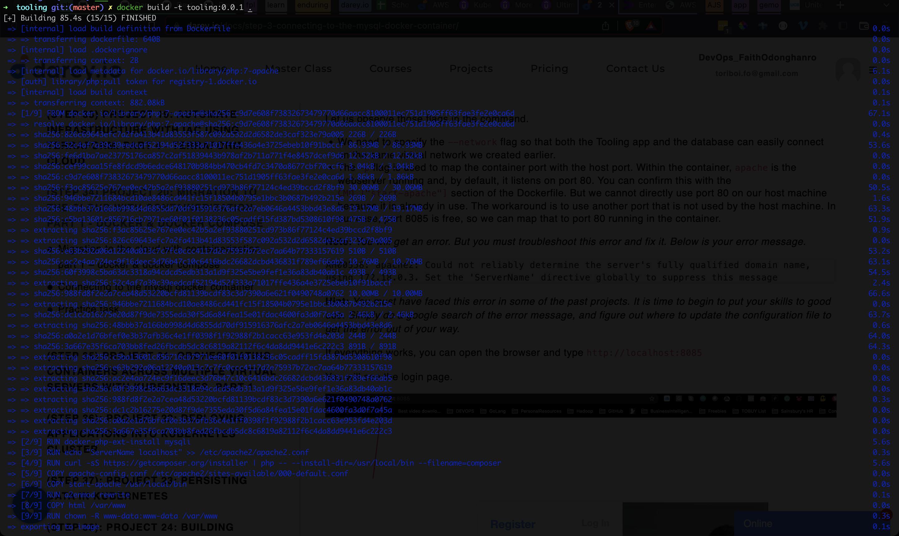

2. Run container
  `docker run --network tooling_app_network -p 8085:80 -it tooling:0.0.1`

# Practice Task

### 1. Implement a POC to migrate the PHP-Todo app into a containerized application

##### Part 1
1. Write a Dockerfile for the TODO app
2. Run both database and app on your laptop Docker Engine
3. Access the application from the browser

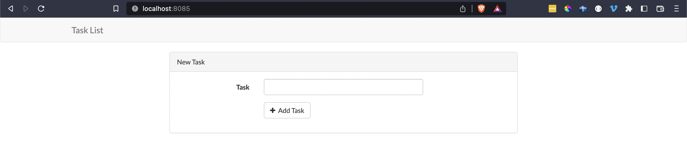

##### Part 2
1. Create an account in Docker Hub
2. Create a new Docker Hub repository
3. Push the docker images from your PC to the repository

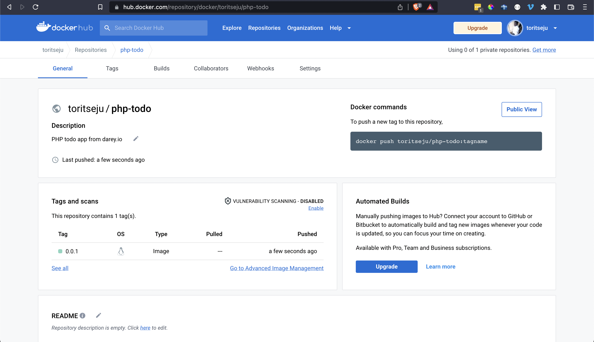

##### Part 3
1. Write a Jenkinsfile that will simulate a Docker Build and a Docker Push to the registry
2. Connect your repo to Jenkins
3. Create a multi-branch pipeline
4. Simulate a CI pipeline from a feature and master branch using previously created Jenkinsfile
5. Ensure that the tagged images from your Jenkinsfile have a prefix that suggests which branch the image was pushed from. For example, feature-0.0.1.
6. Verify that the images pushed from the CI can be found at the registry.

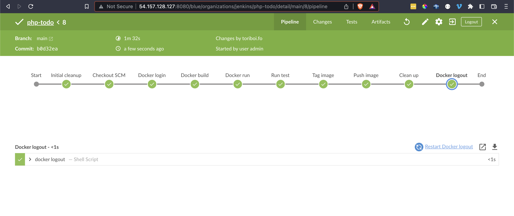

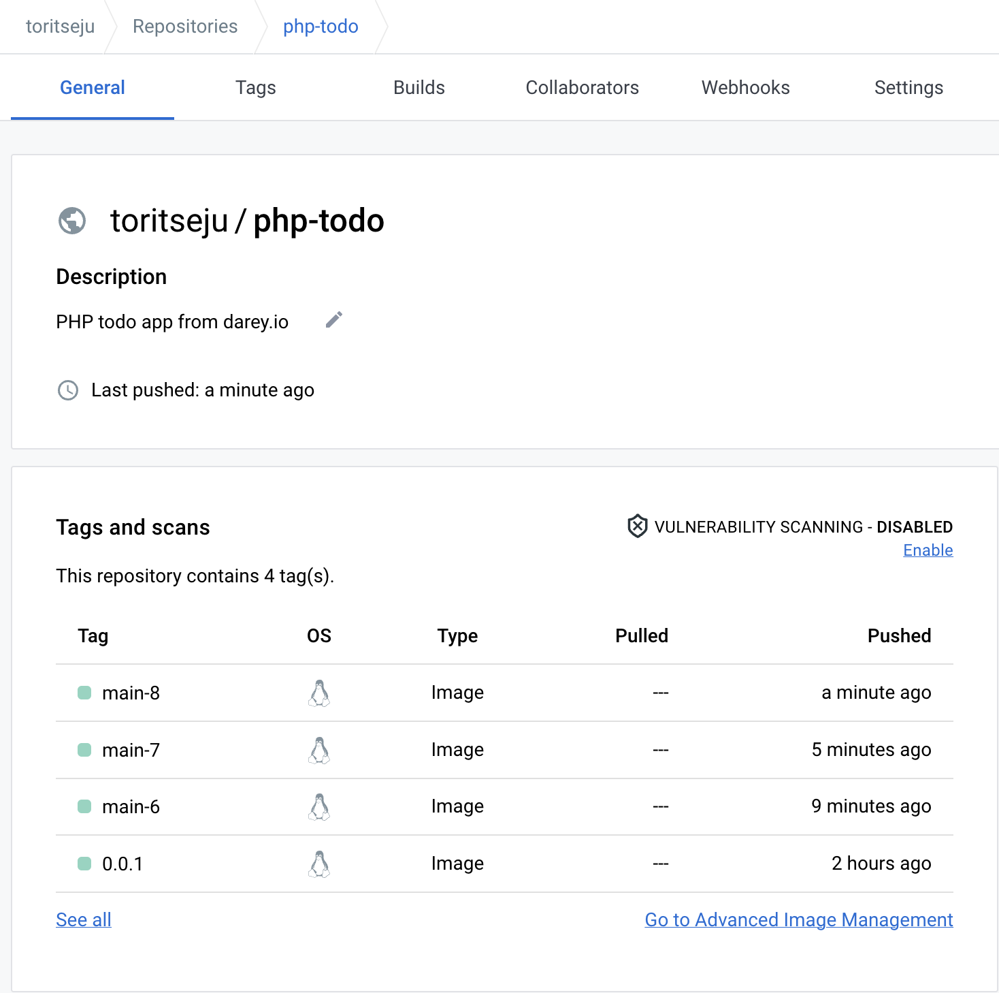

### Deployment with Docker Compose

Modified Tooling application to run use docker-compose

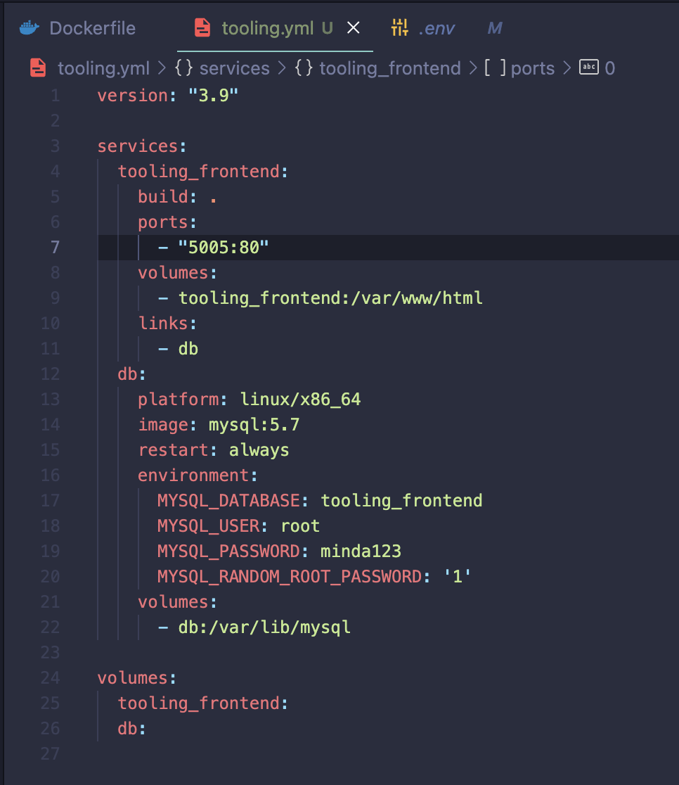

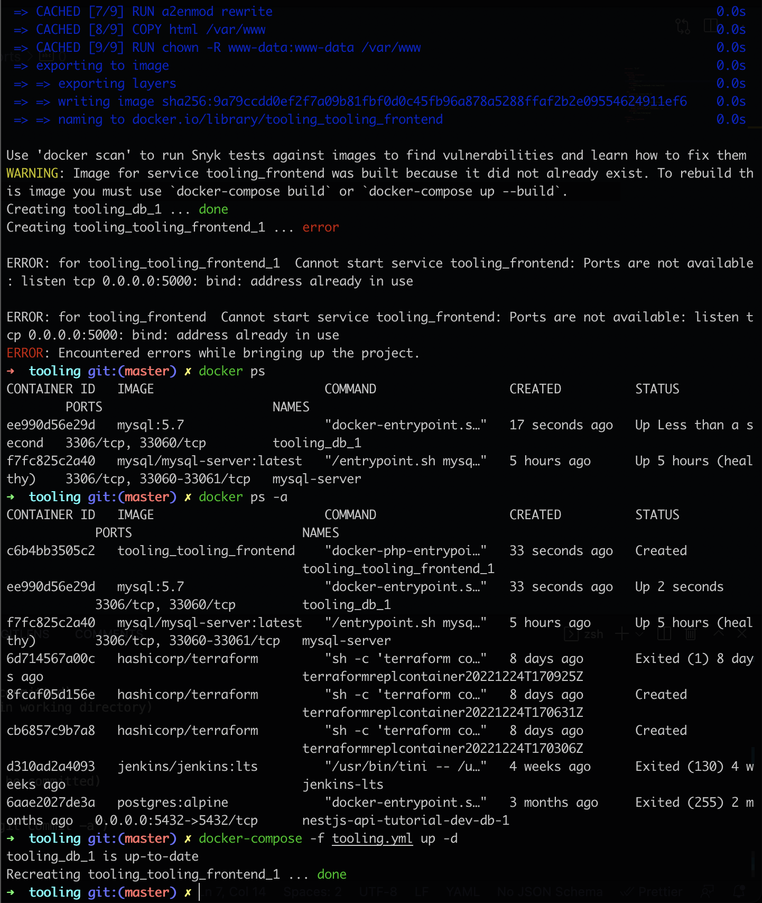

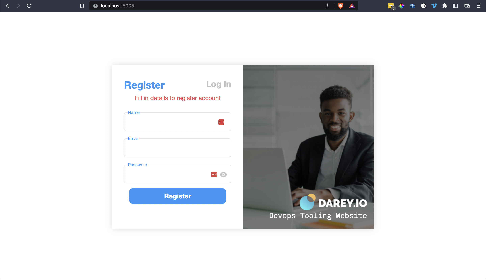

### Code
Code can be found in the [php-todo](https://github.com/toritsejuFO/php-todo) repo.
