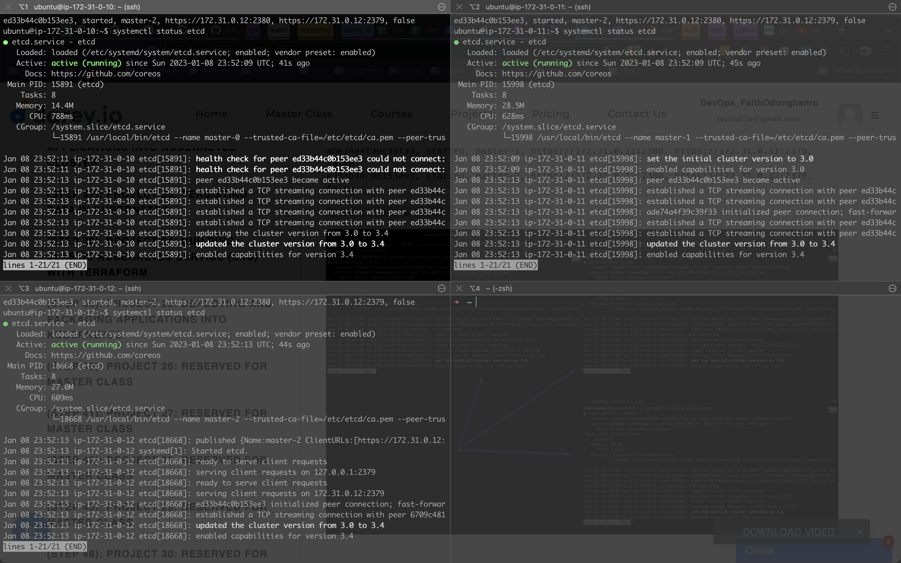

# Project 21 - Orchestrating containers across multiple Virtual Servers with Kubernetes. Part 1

## Synopsis
-----------
In previous Project 20 you have started to work with containerization and have learned how to prepare and deploy a Docker container using Docker Compose.

In this project, you will continue building upon your containerization skills, and begin to work on industry tools that fit for production deployment (Kubernetes).

Kubernetes is a tool designed to do Container Orchestration and it does its job very well when correctly configured.

### Kubernetes Architecture

Kubernetes is a not a single package application that you can install with one command, it is comprised of several components, some of them can be deployed as services, some can be also deployed as separate containers.

### Kubernetes From-Ground-Up

To successfully implement "K8s From-Ground-Up", the following and even more will be done by you as a K8s administrator:

Install and configure master (also known as control plane) components and worker nodes (or just nodes).
Apply security settings across the entire cluster (i.e., encrypting the data in transit, and at rest)
In transit encryption means encrypting communications over the network using HTTPS
At rest encryption means encrypting the data stored on a disk
Plan the capacity for the backend data store etcd
Configure network plugins for the containers to communicate
Manage periodical upgrade of the cluster
Configure observability and auditing

### Tools to be used and expected result of the Project 21

* VM: AWS EC2
* OS: Ubuntu 20.04 lts+
* Docker Engine
* `kubectl` console utility
* `cfssl` and `cfssljson` utilities
* Kubernetes cluster

You will create 3 EC2 Instances, and in the end, we will have the following parts of the cluster properly configured:

* One Kubernetes Master
* Two Kubernetes Worker Nodes
* Configured SSL/TLS certificates for Kubernetes components to communicate securely
* Configured Node Network
* Configured Pod Network

### 1. Install client tools before bootstrapping the cluster.

1. `awscli` – is a unified tool to manage your AWS services
2. `kubectl` – this command line utility will be your main control tool to manage your K8s cluster. You will use this tool so many times, so you will be able to type ‘kubetcl’ on your keyboard with a speed of light. You can always make a shortcut (alias) to just one character ‘k’. Also, add this extremely useful official kubectl Cheat Sheet to your bookmarks, it has examples of the most used ‘kubectl’ commands.
3. `cfssl` – an open source toolkit for everything TLS/SSL from Cloudflare
4. `cfssljson` – a program, which takes the JSON output from the cfssl and writes certificates, keys, CSRs, and bundles to disk.

### 2. Aws cloud resources for kubernetes cluster

#### 2.1 Configure Network Infrastructure

**VPC created**

**Configure DHCP Options Set**

**Subnet**

**Internet Gateway – IGW**

**Route Table**

**Configure security groups**

**Network Load Balancer**

**Tagret Group**

#### 2.2 Create Compute Resources

**AMI**

**SSH key-pair**

### 3. Prepare The Self-Signed Certificate Authority And Generate TLS Certificates

The following components running on the Master node will require TLS certificates.

* kube-controller-manager
* kube-scheduler
* etcd
* kube-apiserver

The following components running on the Worker nodes will require TLS certificates.

* kubelet
* kube-proxy

**Self-Signed Root Certificate Authority (CA)**

**Generating TLS Certificates For Client and Server**

* kube-controller-manager
* kube-scheduler
* etcd
* kubelet
* kube-proxy
* Kubernetes Admin User

### 4. Distributing the Client and Server Certificates

Copy these files securely to the worker nodes using scp utility

* Root CA certificate – ca.pem
* X509 Certificate for each worker node
* Private Key of the certificate for each worker node

### 5. Use `kubectl` to generate kubernetes configuration files for authentication

1. Generate the kubelet kubeconfig file
2. Generate the kube-proxy kubeconfig
3. Generate the Kube-Controller-Manager kubeconfig
4. Generating the Kube-Scheduler Kubeconfig
5. Finally, generate the kubeconfig file for the admin user

### TASK
--------

Distribute the files to their respective servers, using scp and a for loop like we have done previously. This is a test to validate that you understand which component must go to which node.

*Securely copy master and worker node kubeconfig files to remote servers*

### 6. Prepare the etcd database for encryption at rest

**Generate the encryption key and encode it using base64**

**Bootstrap etcd cluster**

### 7. Bootstrap the control plane

**In this section, we configure the components for the control plane on the master/controller nodes**

Kube-scheduler  

Kube-controller-manager

Kube-apiserver  

### 8. Test that Everything is working fine

1. Get the cluster details run:

`kubectl cluster-info  --kubeconfig admin.kubeconfig`

2. Get the current namespaces:

`kubectl get namespaces --kubeconfig admin.kubeconfig`

3. Reach the Kubernetes API Server publicly

`curl --cacert /var/lib/kubernetes/ca.pem https://$INTERNAL_IP:6443/version`

4. Get the status of each component:

`kubectl get componentstatuses --kubeconfig admin.kubeconfig`

### 9. Configure the Kubernetes Worker nodes components

**Installed and configured containerd**

**Installed and configured kubelet**

**Installed and configure kube-proxy**

