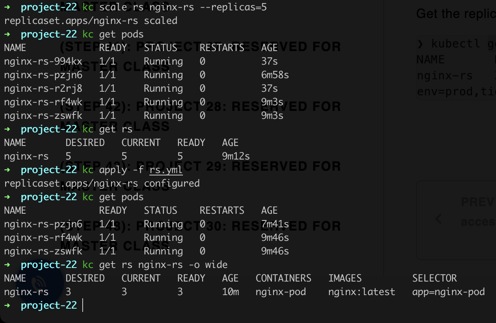

# Project 22 - Deploying Applications Into Kubernetes Cluster

### Synopsis
------------

In this project, you will build upon your knowledge of Kubernetes architecture, and begin to deploy applications on a K8s cluster.

### 1. Deploy a random spp (Nginx) Locally onto minikube cluster

### 2. Create a ReplicaSet

**Create a ReplicaSet of Nginx pod**

**Delete initial pod to test that a replica is spawn up to acheive the desired state**

**Scale replica set up imperatively and back down declaratively**

### 4. Using AWS Load Balancer to Access Your Service in Kubernetes

### 5. Using Deployment Controllers

**Deploy nginx using deployments**

**Exec into one of the Pod’s container to run Linux commands**

### 6. Persisting data for pods

**Modified index.html file for nginx**

**Delete single pod after modification**

**New pod started shows nginx default index.html file**

### Conclusion

In this project, I went through the different paths for deploying an application in kubernets, using manifest files of different `kind`(s), according to kubernetes jargon.

I explored, Pods, Service (of different types including `Loadbalancer` Type), ReplicaSet and Deployments.

I saw that pods are stateless, and so when modifications occur in them, and they die, when a new one is spawn up to ensure the current state meets the desired state, the old data is lost.

# Codes
Code can be found in the [k8s-simple-demo-eks](https://github.com/toritsejuFO/k8s-simple-demo-eks) repo.
