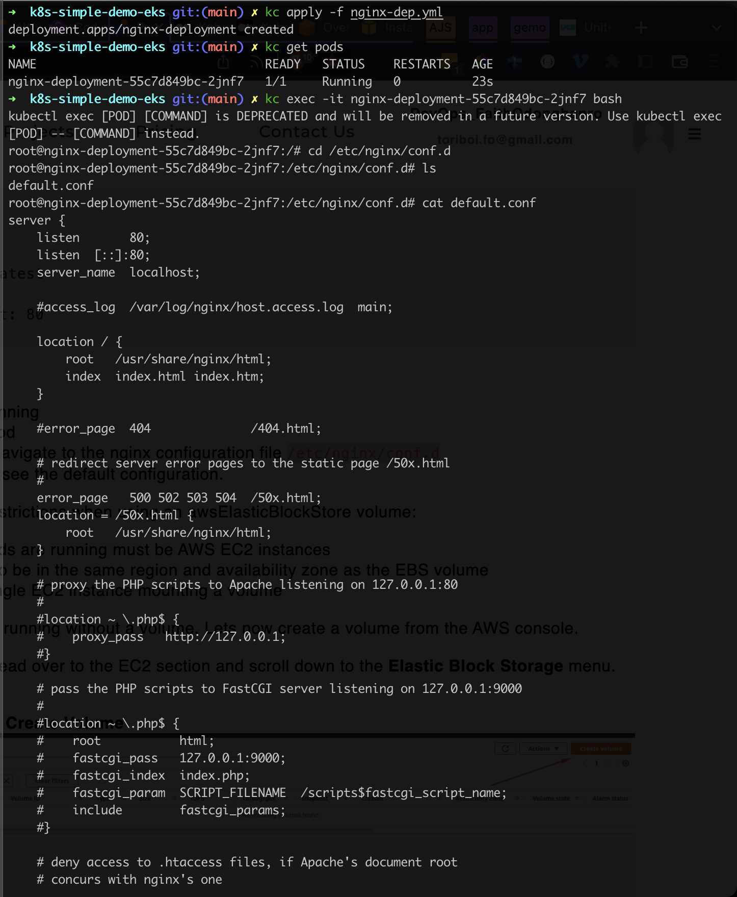
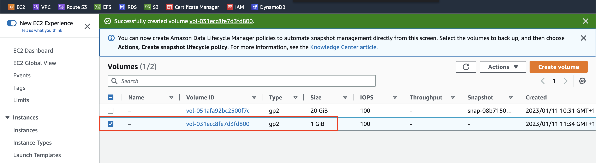
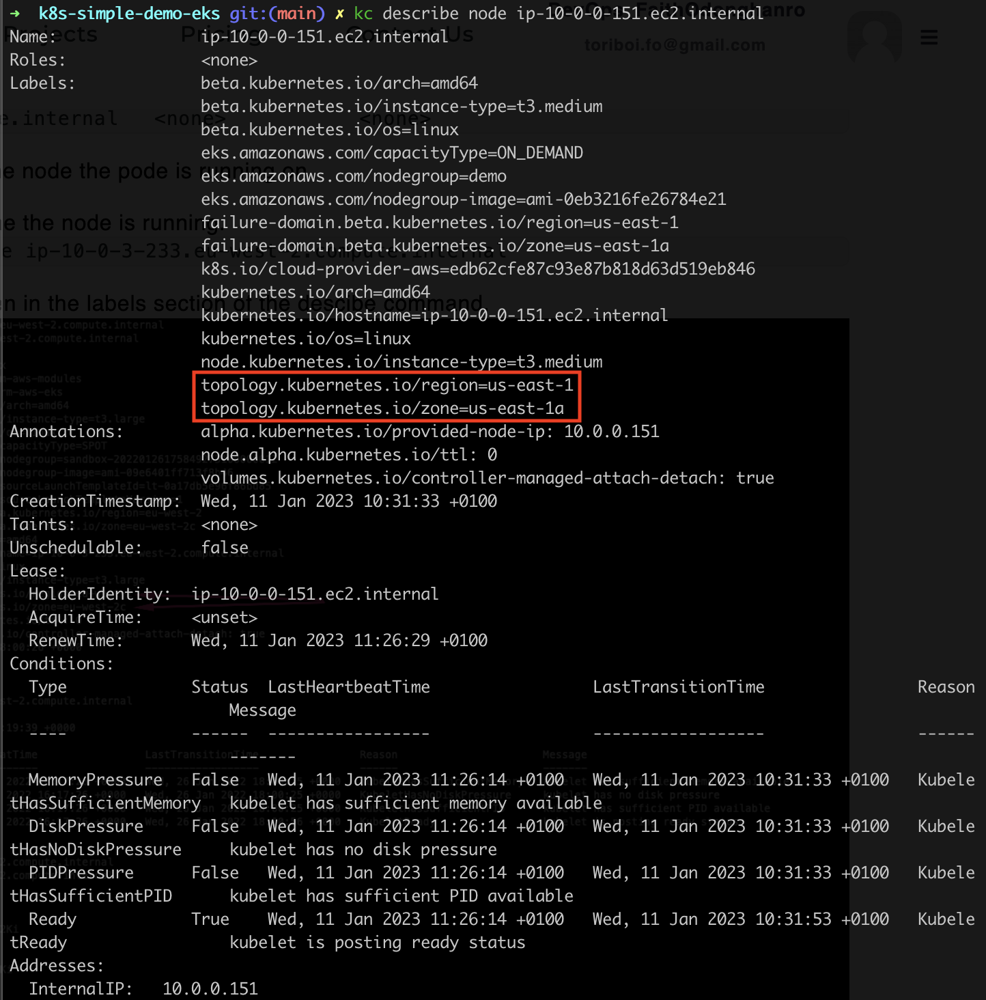
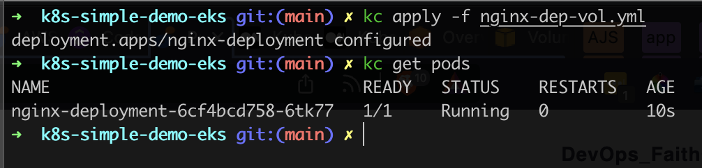
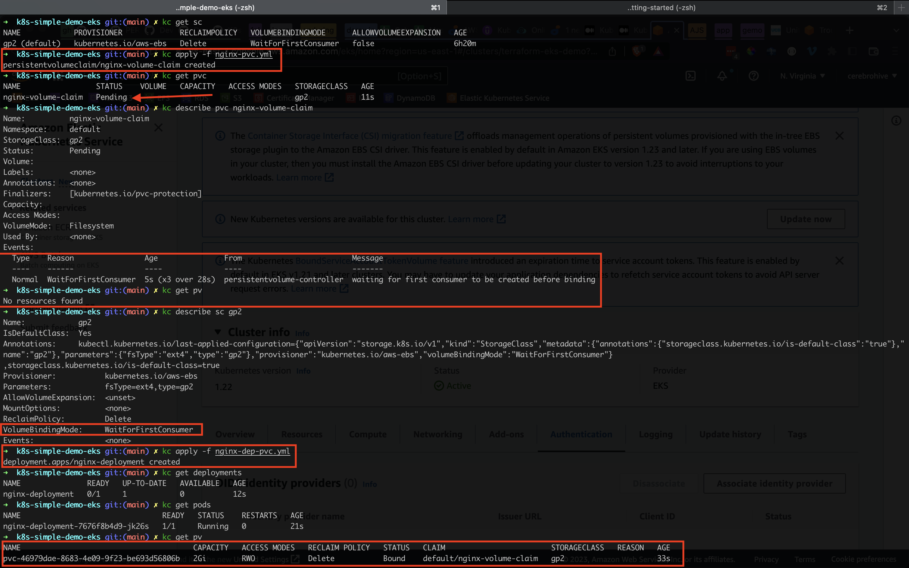
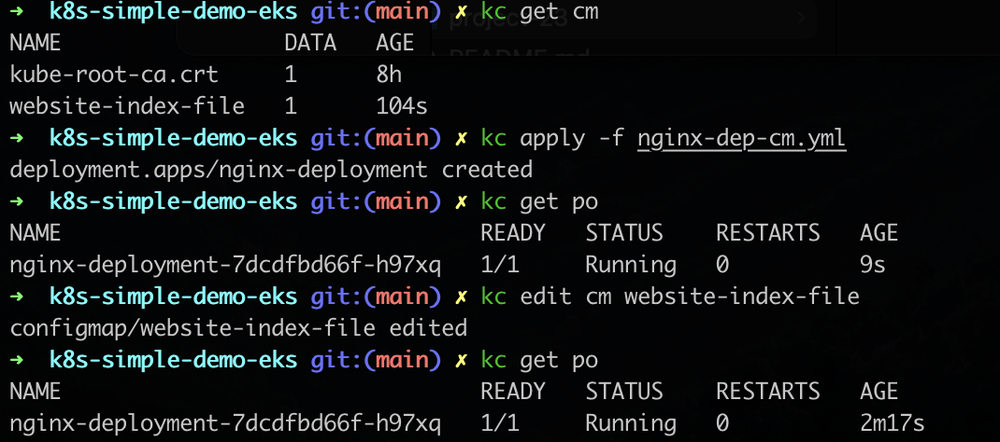

# Project 23 - Persisting Data in Kubernetes

### Synopsis
------------

Building upon what we did in the previous project [22](https://github.com/toritsejuFO/darey.io-projects/tree/main/project-22), here we look at how we can persist data in kubernetes using volumes.

To achieve statefuleness in kubernetes, you must understand how `volumes`, `persistent volumes`, and `persistent volume claims` work.

**Volumes**

On-disk files in a container are ephemeral, which presents some problems for non-trivial applications when running in containers. One problem is the loss of files when a container crashes. The kubelet restarts the container but with a clean state. A second problem occurs when sharing files between containers running together in a Pod. The Kubernetes volume abstraction solves both of these problems

Docker has a concept of volumes, though it is somewhat looser and less managed. A Docker volume is a directory on disk or in another container. Docker provides volume drivers, but the functionality is somewhat limited.

Kubernetes supports many types of volumes. A Pod can use any number of volume types simultaneously. Ephemeral volume types have a lifetime of a pod, but persistent volumes exist beyond the lifetime of a pod. When a pod ceases to exist, Kubernetes destroys ephemeral volumes; however, Kubernetes does not destroy persistent volumes. For any kind of volume in a given pod, data is preserved across container restarts.

At its core, a volume is a directory, possibly with some data in it, which is accessible to the containers in a pod. How that directory comes to be, the medium that backs it, and the contents of it are all determined by the particular volume type used. This means, you must know some of the different types of volumes available in kubernetes before choosing what is ideal for your particular use case.

### 1. Using `awsElasticBlockStore` as volume

**Tasks**

* Verify that the pod is running
* Check the logs of the pod
* Exec into the pod and navigate to the nginx configuration file /etc/nginx/conf.d
* Open the config files to see the default configuration.

**Create a volume from the AWS console**

**Determine node/pod region/az**

**Create pod with attached ebs volume**

#### 1.1 Mounting the volume

The **volumeMounts** which basically answers the question "Where should this Volume be mounted inside the container?" Mounting a volume to a directory means that all data written to the directory will be stored on that volume.

In as much as we now have a way to persist data, we also have new problems.

1. If you port forward the service and try to reach the endpoint, you will get a 403 error. This is because mounting a volume on a filesystem that already contains data will automatically erase all the existing data. This strategy for statefulness is preferred if the mounted volume already contains the data which you want to be made available to the container

2. It is still a manual process to create a volume, manually ensure that the volume created is in the same Avaioability zone in which the pod is running, and then update the manifest file to use the volume ID. All of these is against DevOps principles because it will mean having a lot of road blocks to getting a simple thing done.

The more elegant way to achieve this is through Persistent Volume and Persistent Volume claims.

In kubernetes, there are many elegant ways of persisting data. Each of which is used to satisfy different use cases. Lets take a look at the different options available.

1. `Persistent Volume (PV)` and `Persistent Volume Claim (PVC)`
2. `configMap`

### 2. Managing Volumes dynamically with PVs and PVCs

Kubernetes provides API objects for storage management such that, the lower level details of volume provisioning, storage allocation, access management etc are all abstracted away from the user, and all you have to do is present manifest files that describes what you want to get done.

**PersistedVolume (PVs)** are volume plugins that have a lifecycle completely independent of any individual Pod that uses the PV.

A **PersistentVolumeClaim (PVC)** on the other hand is a request for storage

#### 2.1 Creating Persisted Volume for our Nginx Deployment

**Approach 1: Create a manifest file for a PVC, and based on the gp2 storageClass a PV will be dynamically created**

### 3. ConfigMaps

Using configMaps for persistence is not something you would consider for data storage. Rather it is a way to manage configuration files and ensure they are not lost as a result of Pod replacement.

Here we use configMaps to mount content in a file onto a path in our pod.

# Codes
Code can be found in the [k8s-simple-demo-eks](https://github.com/toritsejuFO/k8s-simple-demo-eks) repo.
