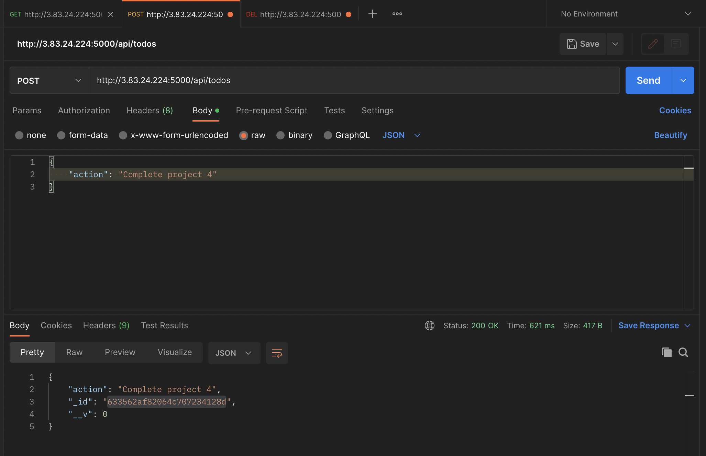

# Project 1 - MERN Stack Implementation

Find below images showing results of execution of MERN Stack implementation steps

## Instance on AWS Showing IP and other EC2 details

## Postman GET all Todos

## Postman POST Todo

## Postman DELETE Todo

## Todo Frontend Client

