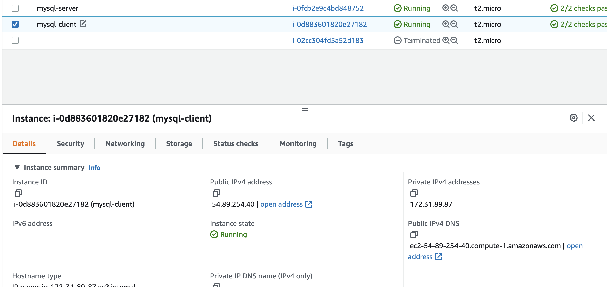
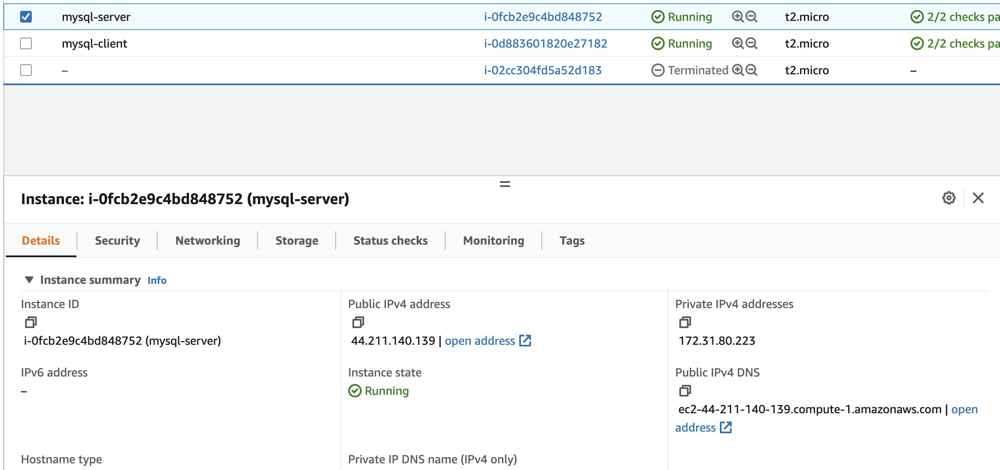
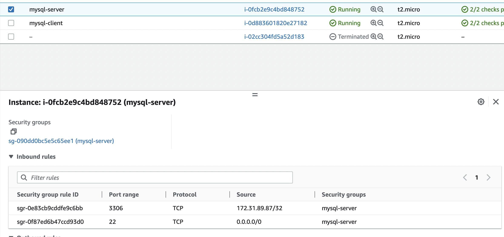
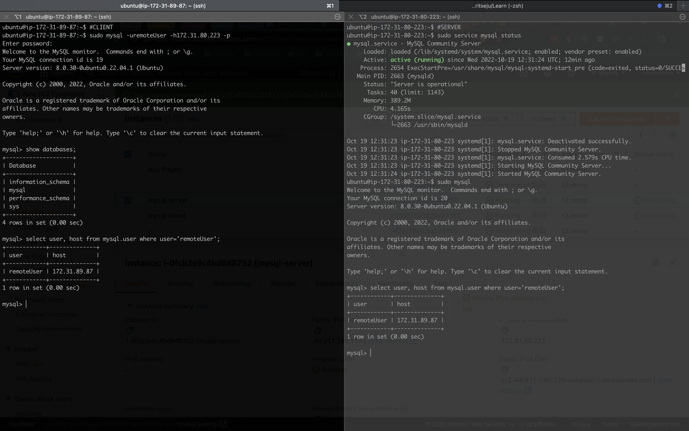

# Project 5 - Client/Server Architecture Using a Mysql Relational Database Management System

Implementation of the Client/Server architecture using Mysql RDBMS.

The implementation allows a remote instance with the mysql client installed on it to connect remotely to another (remote) instance running mysql server.

This connection is done via the local IPs of the both instances, this is possible because they both exist on the same local network (VPC).

### Mysql Client Instance on AWS

### Mysql Server Instance on AWS

### Mysql Server Instance on AWS
Below is an image showing the security group of the mysql server instance, allowing traffic on port 3306 from only the private ip of the client instance.

## Image showing successful remote connection

Below is shown, two terminal connections, the client on the left, and the server on the right. It We see a successful connection from the mysql client running on the client instance to the mysql server running on the server instance.

The connection is possible via a `remoteUser` created on the mysql server, which is allowed to connect from the private ip of the client instance.

