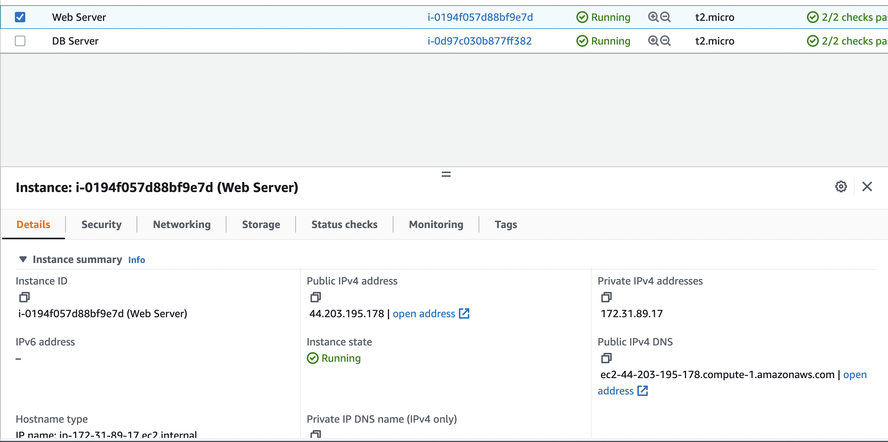
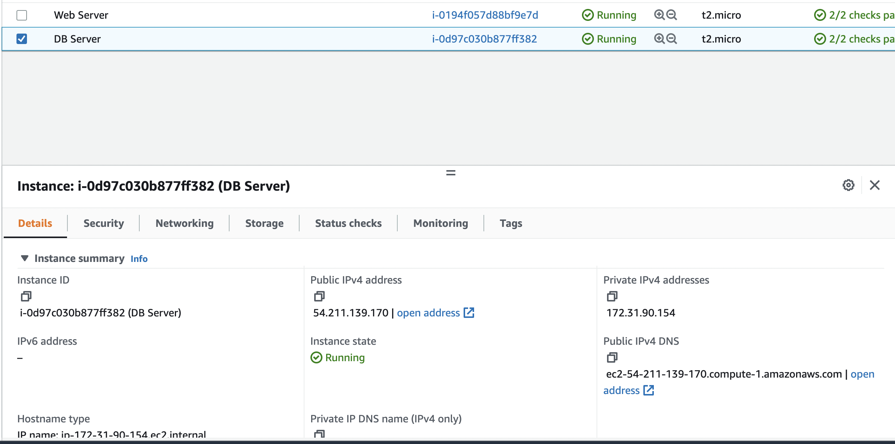
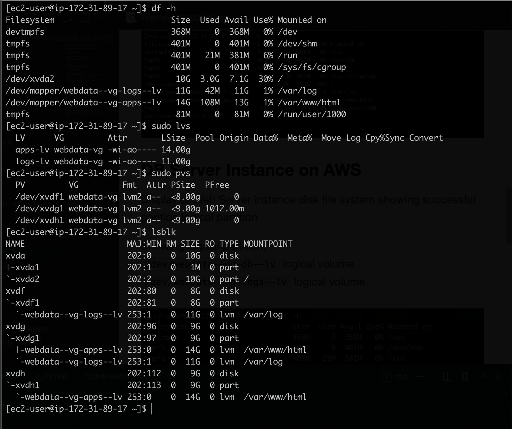
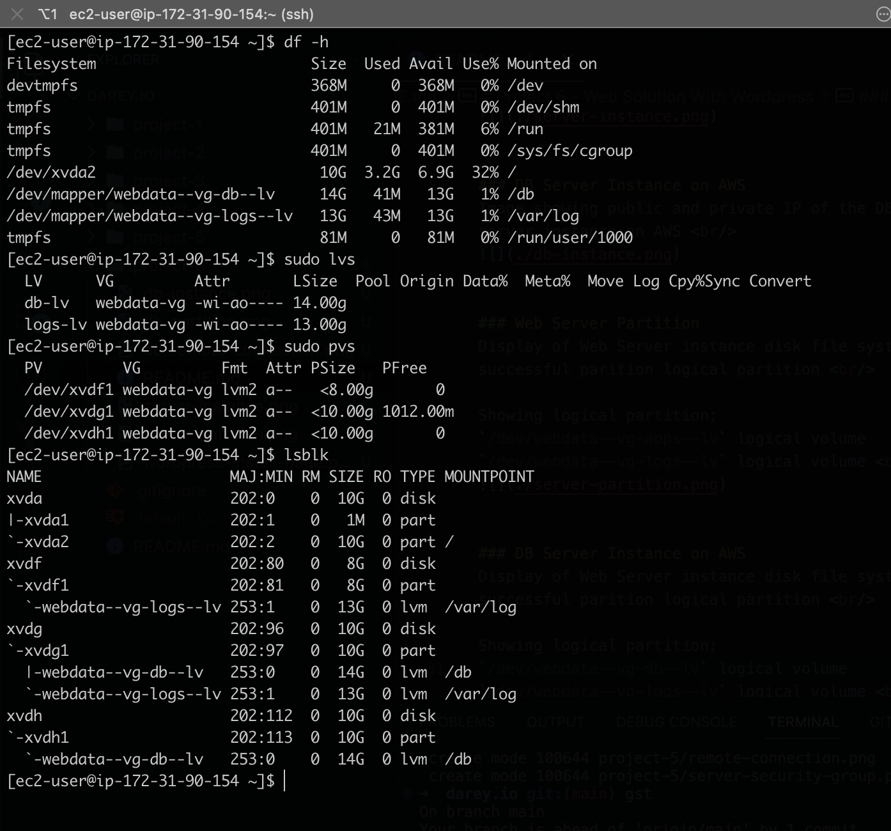
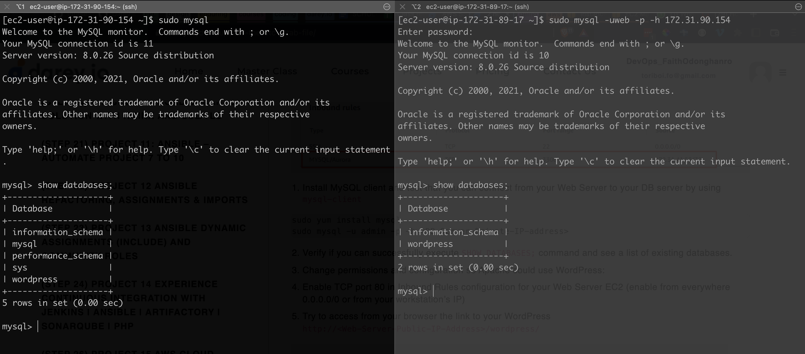
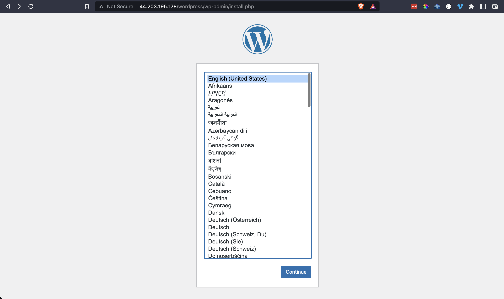

# Project 6 - Web Solution With Wordpress

Implementation of the Web Solution With Wordpress Project.

### High Level Requirement (Context)
In this project you will be tasked to prepare storage infrastructure on two Linux servers and implement a basic web solution using WordPress. WordPress is a free and open-source content management system written in PHP and paired with MySQL or MariaDB as its backend Relational Database Management System (RDBMS).

Project 6 consists of two parts:

Configure storage subsystem for Web and Database servers based on Linux OS. The focus of this part is to give you practical experience of working with disks, partitions and volumes in Linux.

Install WordPress and connect it to a remote MySQL database server. This part of the project will solidify your skills of deploying Web and DB tiers of Web solution.

### Web Server Instance on AWS
Image showing public and private IP of the web server instance on AWS  

### DB Server Instance on AWS
Image showing public and private IP of the DB (mysql) server instance on AWS  

### Web Server Partition
Display of Web Server instance disk file system showing successful parition logical partition  

Showing logical partition;
`/dev/webdata--vg-apps--lv` logical volume
`/dev/webdata--vg-logs--lv` logical volume  

### DB Server Instance on AWS
Display of Web Server instance disk file system showing successful parition logical partition  

Showing logical partition;
`/dev/webdata--vg-db--lv` logical volume
`/dev/webdata--vg-logs--lv` logical volume  

### Mysql remote connection
Result of successful database remote connection between Web Server instance and DB server instance using local IP  

### Mysql Client Instance on AWS
Successful wordpress installation page via Web Server instance public IP  

