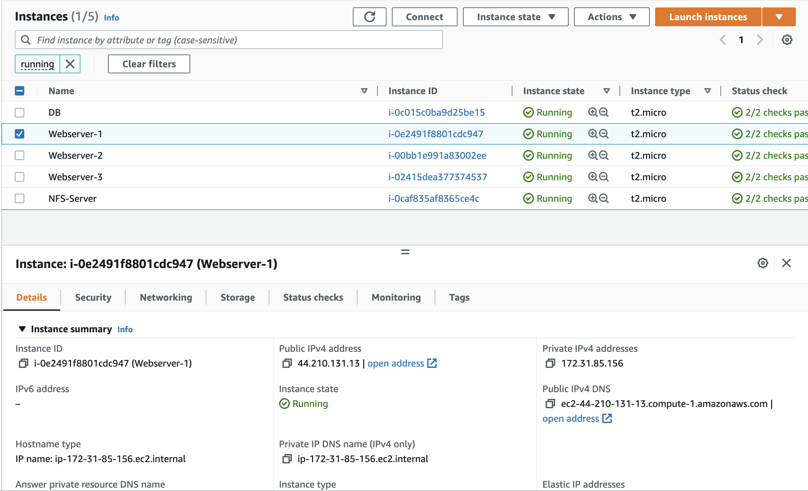
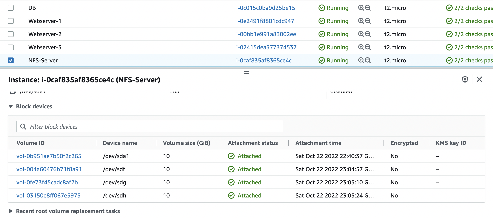
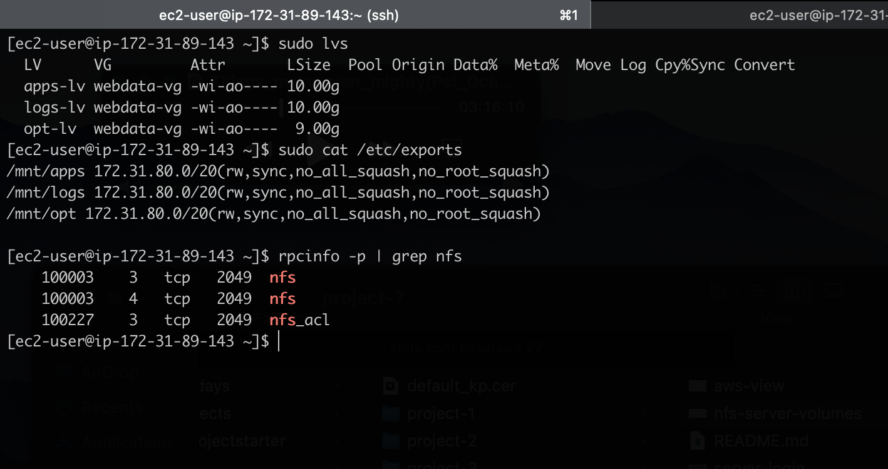
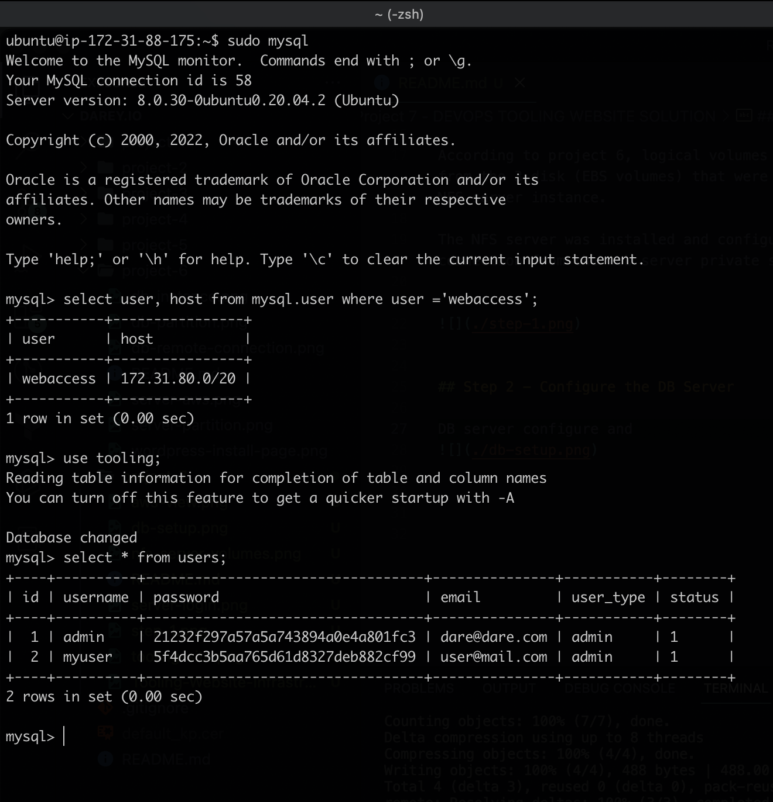
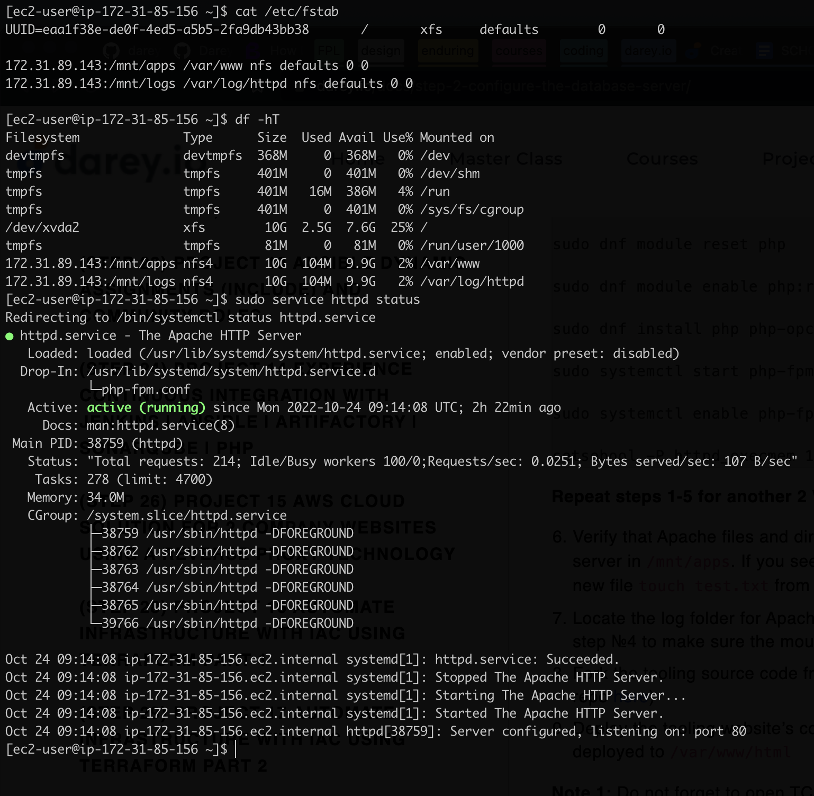
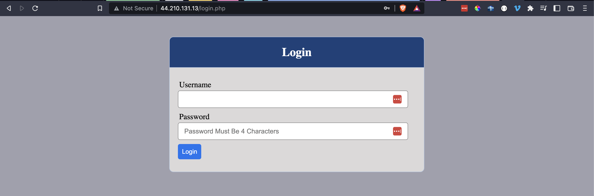
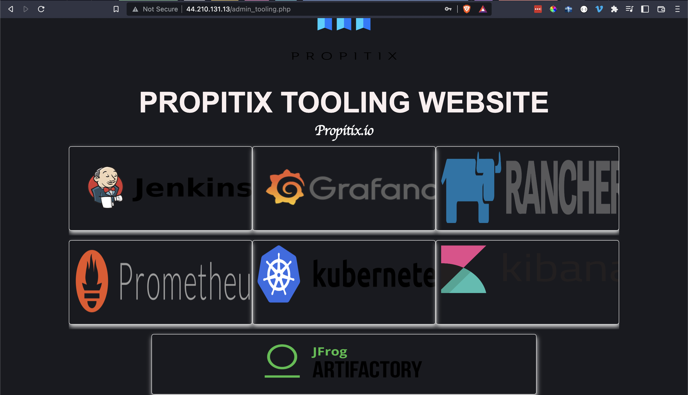

# Project 7 - DEVOPS TOOLING WEBSITE SOLUTION

## About
On the diagram below you can see a common pattern where several stateless Web Servers share a common database and also access the same files using Network File Sytem (NFS) as a shared file storage. Even though the NFS server might be located on a completely separate hardware – for Web Servers it look like a local file system from where they can serve the same files.

### AWS view of NFS, Web and DB Servers

### AWS of NFS server volumes

## Step 1 - Prepare NFS Server

According to project 6, logical volumes were created from the 3 disk (EBS volumes) that were attached to the NFS server instance.  

The NFS server was installed and configured to allow connection from the web server private subnet cidr.

## Step 2 - Configure the DB Server

DB server installed and configured to receive requests from web server private subnet cidr.

Shows results of running `tooling.db.sql` script remotely from one of the web servers to create `users` table and insert a couple of data.

## Step 3 - Prepare the Web Servers

Web server configuration:
- NFS client was installed
- The remote NFS server was mounted to the servers (both for the apps and logs mount path)
- Installed Apache web server and PHP

Configurations were repeated for the other 2 remaining servers.

## Website in Browser

