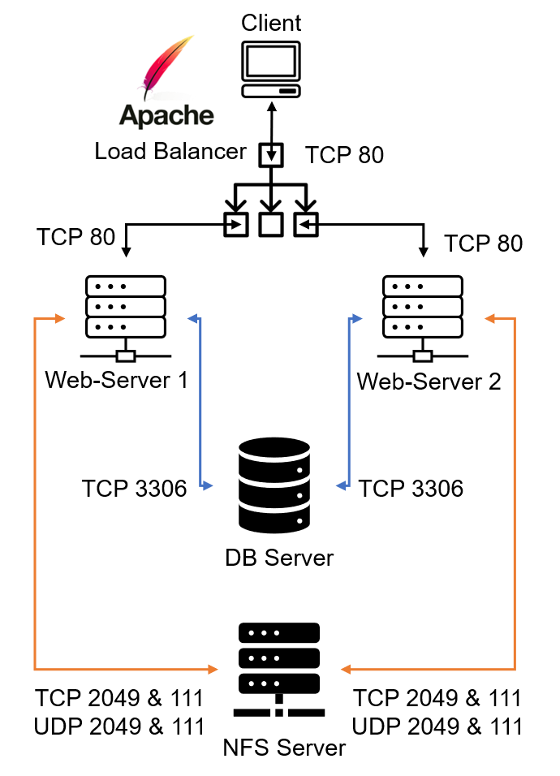

# Project 8 - LOAD BALANCER SOLUTION WITH APACHE

In this project we will enhance our Tooling Website solution by adding a Load Balancer to disctribute traffic between Web Servers and allow users to access our website using a single URL.

Task
Deploy and configure an Apache Load Balancer for Tooling Website solution on a separate Ubuntu EC2 intance. Make sure that users can be served by Web servers through the Load Balancer.

To simplify, let us implement this solution with 2 Web Servers, the approach will be the same for 3 and more Web Servers.

## Configure Apache as a Load Balancer

Ubuntu server started with apache load balancer configured on it to proxy to 2 of the previously setup web servers.

#### LB instance on AWS

#### Configure Local DNS Names Resolution

### Load Balancer Test

Curl web servers localy and from browser, verify distribution of request across the two (2) web servers.

