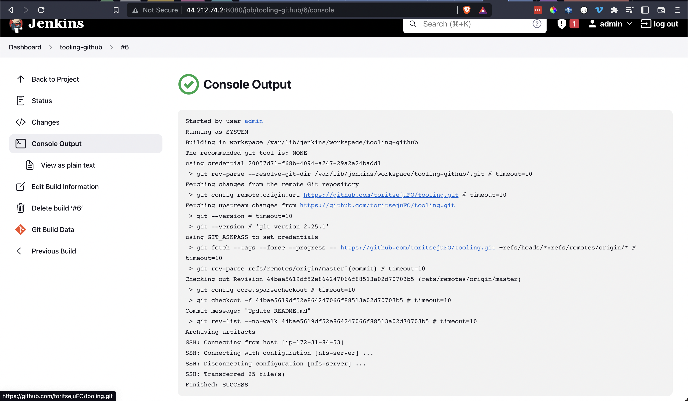

# Project 8 - CONTINOUS INTEGRATION PIPELINE FOR TOOLING WEBSITE

Task
Enhance the architecture prepared in Project 8 by adding a Jenkins server, configure a job to automatically deploy source codes changes from Git to NFS server.

Here is how your updated architecture will look like upon competion of this project:  

### Jenkins AWS Instance

### Install and Configure Jenkins Server

- Installed and configured Jenkins Server
- Configured github webhook
- Build successful after modification to files on github  

### Configure Jenkins to copy files to NFS Server via SSH

- __Publish Over SSH__ plugin configured
- Build artifacts sent over to NFS Server via ssh  

